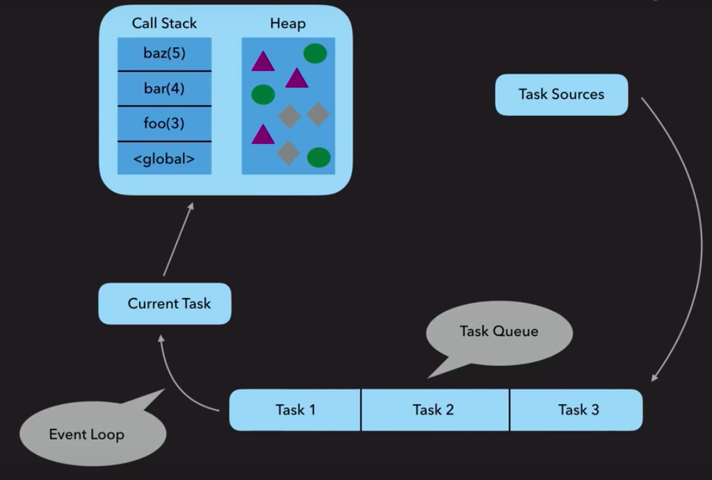
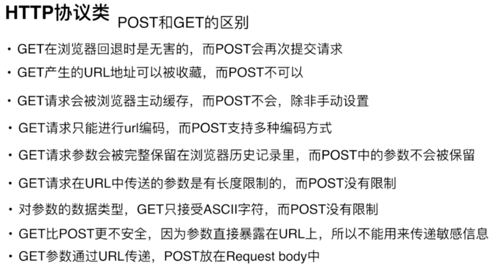
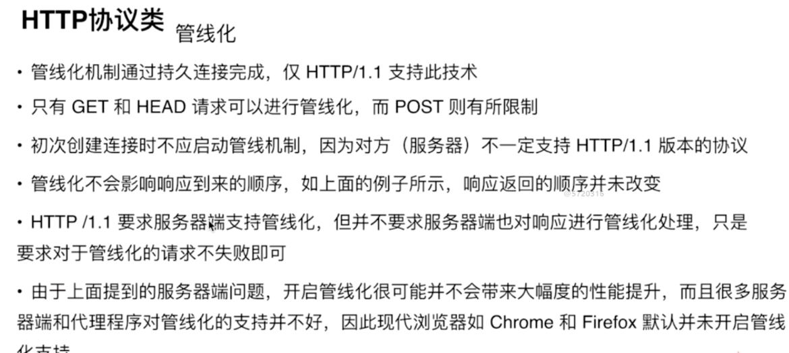

### 2018/06/30

##### Kernel&Shell

- Kernel（核），操作系统的中心，分配时间和内存；处理文件存储和通讯以响应系统的调用。
- Shell（壳），一种用户与kernel之间的接口。

##### POSIX

- Portable Operating System Interface 
- 一种标准，定义了标准API用于兼容各种系统 

##### REST

- Representational State Transfer
- 一种万维网软件架构风格
- 目的是便于软件/程序在网络中传递数据
- 基于HTTP之上而确定的一组约定和属性

##### Snapchat

##### http cache strategy

- [https://segmentfault.com/a/1190000008956069](https://segmentfault.com/a/1190000008956069)
- https://zhuanlan.zhihu.com/p/23299600?refer=study-fe

##### shell scripting

- [https://github.com/qinjx/30min_guides/blob/master/shell.md](https://github.com/qinjx/30min_guides/blob/master/shell.md)
- [https://www.shellscript.sh/](https://www.shellscript.sh/)

##### JavaScript design pattern

- [http://wiki.jikexueyuan.com/project/javascript-design-patterns/mvc.html](http://wiki.jikexueyuan.com/project/javascript-design-patterns/mvc.html)
- [https://addyosmani.com/resources/essentialjsdesignpatterns/book/#detailmvc](https://addyosmani.com/resources/essentialjsdesignpatterns/book/#detailmvc)

### 2018/07/01

##### Lisp系语言（函数式编程范式）

- [http://www.ruanyifeng.com/blog/2010/10/why_lisp_is_superior.html](http://www.ruanyifeng.com/blog/2010/10/why_lisp_is_superior.html)

##### 算法语言Scheme

- [https://r6rs.mrliu.org/](https://r6rs.mrliu.org/)

##### SICP课程/PPT/习题集

- [http://groups.csail.mit.edu/mac/classes/6.001/abelson-sussman-lectures/](http://groups.csail.mit.edu/mac/classes/6.001/abelson-sussman-lectures/)
- [http://www.math.pku.edu.cn/teachers/qiuzy/progtech/MIT_slides/](http://www.math.pku.edu.cn/teachers/qiuzy/progtech/MIT_slides/)
- [http://sicp.readthedocs.io/en/latest/](http://sicp.readthedocs.io/en/latest/)
- [http://numbbbbb.com/2016/03/28/20160328_%E6%88%91%E5%A6%82%E4%BD%95%E7%94%A8%E4%B8%A4%E5%91%A8%E6%97%B6%E9%97%B4%E5%88%B7%E5%AE%8C%20SICP/](http://numbbbbb.com/2016/03/28/20160328_%E6%88%91%E5%A6%82%E4%BD%95%E7%94%A8%E4%B8%A4%E5%91%A8%E6%97%B6%E9%97%B4%E5%88%B7%E5%AE%8C%20SICP/)

##### Linked List

- [https://codeburst.io/js-data-structures-linked-list-3ed4d63e6571](https://codeburst.io/js-data-structures-linked-list-3ed4d63e6571)

##### 时空复杂度

- [https://blog.csdn.net/zolalad/article/details/11848739](https://blog.csdn.net/zolalad/article/details/11848739)

##### Generator

- [https://gu.illau.me/posts/polyfilling-generators/](https://gu.illau.me/posts/polyfilling-generators/)

##### Underscore 整体架构

- [https://github.com/hanzichi/underscore-analysis/issues/27](https://github.com/hanzichi/underscore-analysis/issues/27)

### 2018/07/02

##### Javascript类型检查

- [https://webbjocke.com/javascript-check-data-types/](https://webbjocke.com/javascript-check-data-types/)

```javascript

//check Array

function isArray(value){

	return typeof value === ‘object’ && value instaceof Array //用constructor来判断容易伪造

}

Array.isArray(value)

//check null

function isNull(value){

	return value === null

}

//check NaN

isNaN(value)
```

##### vim替换
- [http://tanqisen.github.io/blog/2013/01/13/vim-search-replace-regex/](http://tanqisen.github.io/blog/2013/01/13/vim-search-replace-regex/)
- [http://vimregex.com/](http://vimregex.com/)
##### SDK
##### DP(dynamic programming)

- 把一个问题划分成若干子问题，相同的子问题只需解决一次进而减少了计算量。

##### jj

```

:imap jj <Esc>

```

### 2018/07/03

##### why primitive type of string instanceof String is false but can inherit method from prototype chain

- [https://javascriptrefined.io/the-wrapper-object-400311b29151](https://javascriptrefined.io/the-wrapper-object-400311b29151)
- [https://hacks.mozilla.org/2012/12/performance-with-javascript-string-objects/](https://hacks.mozilla.org/2012/12/performance-with-javascript-string-objects/)

##### requestAnimationFrame

- [https://javascript.ruanyifeng.com/htmlapi/requestanimationframe.html](https://javascript.ruanyifeng.com/htmlapi/requestanimationframe.html)
- [https://hacks.mozilla.org/2011/08/animating-with-javascript-from-setinterval-to-requestanimationframe/](https://hacks.mozilla.org/2011/08/animating-with-javascript-from-setinterval-to-requestanimationframe/)

### 2018/07/04

##### how browsers work
- [https://medium.com/@ramsunvtech/behind-browser-basics-part-1-b733e9f3c0e6](https://medium.com/@ramsunvtech/behind-browser-basics-part-1-b733e9f3c0e6)
- [https://coolshell.cn/articles/9666.html](https://coolshell.cn/articles/9666.html)
- [https://blog.sessionstack.com/how-javascript-works-the-rendering-engine-and-tips-to-optimize-its-performance-7b95553baeda](https://blog.sessionstack.com/how-javascript-works-the-rendering-engine-and-tips-to-optimize-its-performance-7b95553baeda)
- [https://www.html5rocks.com/zh/tutorials/internals/howbrowserswork/](https://www.html5rocks.com/zh/tutorials/internals/howbrowserswork/)


##### 数组去重

-   [https://github.com/mqyqingfeng/Blog/issues/27](https://github.com/mqyqingfeng/Blog/issues/27)
- [https://github.com/huangchucai/My-Note-Blog/issues/13](https://github.com/huangchucai/My-Note-Blog/issues/13)
  
##### Persistence data

- [https://www.datastax.com/dev/blog/what-persistence-and-why-does-it-matter](https://www.datastax.com/dev/blog/what-persistence-and-why-does-it-matter)


### 2018/07/05

##### <a href='./img/guide for learning computer language.png'>语言学习指南</a>

##### [项目结构目录](https://www.dropbox.com/s/7c2v7es1dg3c730/Screenshot%202018-07-05%2001.25.05.png?dl=0)

##### bindRight实现
-   https://code.h5jun.com/qig/edit?js,console

  ```javascript
  Function.prototype.bindRight = function(thisObj, ...values){
    let fn = this, len = fn.length - values.length;
    return function(...args){
      let rest = [], rargs = values.reverse();
      
      if(len > 0){
        rest = args.slice(0, len);
      }

      return fn.apply(thisObj, rest.concat(rargs));
    }
  }

  console.log(["2","3","4"].map(parseInt));

  console.log(["2","3","4"].map(parseInt.bindRight(null, 10)));

  function add(x, y, z){
      return 100*x + 10 * y + z;
  }

  let add1 = add.bind(null, 1, 2);
  let add2 = add.bindRight(null, 1, 2);

  console.log(add1(3)); //123
  console.log(add2(3)); //321
  ```

  ​

##### 倒计时动画
- https://code.h5jun.com/vix/edit?js,output
- https://code.w3ctech.com/detail/239

##### 月影code
- https://code.w3ctech.com/465?page=3
- https://code.w3ctech.com/465?page=2
- https://code.w3ctech.com/465?page=1

##### CSS水平、垂直居中
- https://sokrati.com/csswarriors/css-horizontal-vertical-centering/
- http://louiszhai.github.io/2016/03/12/css-center/

##### eventloop
- https://itnext.io/how-javascript-works-in-browser-and-node-ab7d0d09ac2f
- https://hackernoon.com/understanding-js-the-event-loop-959beae3ac40


### 2018/07/06

##### CSS3 3D transforms

- https://3dtransforms.desandro.com/


##### Dymatic vs Static, Strong vs Weak

- Dymatic versus static is about when to check for types, strong versus weak is about how serious do you get while checking the types.
- JS is dymatic and weak language.
- Dymatic means checking the types and looking for type errors during runtime.On the contrary, statics does during compile time.
- Weak means allowing implicit conversion. Strongs is opposite.
- https://www.youtube.com/watch?v=C5fr0LZLMAs

##### 有趣的JS教程

- https://www.youtube.com/watch?v=muFql8Z4sCg&list=PL-xu4i_QDSxcoDNeh8rx5-pHCCTOg0XsI
- https://en.hexlet.io/courses/intro_to_programming

##### 深入JS动态、弱类型特性

- https://dzone.com/articles/understanding-loose-typing-jav
- [https://medium.com/@gaperton/typescript-static-or-dynamic-64bceb50b93e](https://medium.com/@gaperton/typescript-static-or-dynamic-64bceb50b93e)
- https://softwareengineering.stackexchange.com/questions/122205/what-is-the-supposed-productivity-gain-of-dynamic-typing


### 2018/07/07

##### package-lock.josn

- https://medium.com/@Quigley_Ja/everything-you-wanted-to-know-about-package-lock-json-b81911aa8ab8

##### 柯里化

- 把多参函数转化为单参函数

```javascript
function curryIt(fn) {
    let args = []
    let countDown = fn.length
    return function(){
        args.push(arguments[0])
        if(--countDown <= 0) return fn.apply(undefined, args)
        return arguments.callee
    }
}

// 测试用例
var fn = function (a, b, c) {return a + b + c}; 
curryIt(fn)(1)(2)(3); // 6
```

##### 获取数字 num 二进制形式第 bit 位的值

```javascript
// 注意：
// 1、bit 从 1 开始
// 2、返回 0 或 1
// 3、举例：2 的二进制为 10，第 1 位为 0，第 2 位为 1

function valueAtBit(num, bit) {
    return +num.toString(2).split('').reverse().slice(bit - 1, bit)
}

// 测试用例
valueAtBit(128, 8) // 1
```

##### 求 a 和 b 相乘的值，a 和 b 可能是小数，需要注意结果的精度问题

```javascript
function multiply(a, b) {
    return a * getMultiple(a) * b * getMultiple(b)/ getMultiple(a) / getMultiple(b)
}

function getMultiple(num){
    return Math.pow(10, ((num + '').length - 1 - ((num + '').indexOf('.'))))
}

// 测试用例
multiply(3, 0.0001) // 0.0003

```


### 2018/07/08

##### 给定字符串 str，检查其是否包含 连续3个数字 

```javascript
// 1、如果包含，返回最新出现的 3 个数字的字符串
// 2、如果不包含，返回 false
// 注意：必须是三个连续数

function captureThreeNumbers(str) {
    let temp = ''
	let arr = str.split('')
	for(let i = 0; i < arr.length; i++){
		if(Math.abs(+arr[i] - +arr[i+1]) === 1){
			if(temp[1]){
				if(Math.abs(+temp[0] - +arr[i]) === 2) return temp += arr[i]
				temp = ''
			}else temp += arr[i]			
        }else temp = ''
	}
	return false
}

// 测试用例

captureThreeNumbers('9896543') // 654
```

##### Regexp railroad diagram

- https://regexper.com/

##### 给定字符串 str，检查其是否符合美元书写格式

```javascript
// 1、以 $ 开始
// 2、整数部分，从个位起，满 3 个数字用 , 分隔
// 3、如果为小数，则小数部分长度为 2
// 4、正确的格式如：$1,023,032.03 或者 $2.03，错误的格式如：$3,432,12.12 或者 $34,344.3
// 小数点后两位是一定要写的

function isUSD(str) {
    return /^\$\d{1,3}(,\d{3})*\.\d{2}$/g.test(str)
}

// 测试用例
isUSD('$20,933,209.93') // true

```

##### Detect Pangram

- http://www.codewars.com/kata/545cedaa9943f7fe7b000048/solutions/javascript/all/clever

```javascript
// A pangram is a sentence that contains every single letter of the alphabet at least once. For example, the sentence "The quick brown fox jumps over the lazy dog" is a pangram, because it uses the letters A-Z at least once (case is irrelevant).
// Given a string, detect whether or not it is a pangram. Return True if it is, False if not. Ignore numbers and punctuation.

function isPangram(string){
  string = string.toLowerCase()
  let hash = {}
  let count = 0
  for(let v of str){
    if(/[a-z]/.test(v)){
      count++
      if(hash[v]) count--
      hash[v] = true
    }
  }
  return count === 26
}

//clever
function isPangram(string){
// assertions => x(?=y)匹配x后面必须有y 与 x(?!y)匹配x后面不能有y
  return (string.match(/([a-z])(?!.*\1)/ig) || []).length === 26;
}
```

##### Contains Duplicate

-   https://leetcode.com/submissions/detail/162597934/

  ```javascript
  // Given an array of integers, find if the array contains any duplicates.
  //	Your function should return true if any value appears at least twice in the array, and it should return false if every element is distinct.

  function containsDuplicate(nums){
    const visited = new Set()
    for(let num of nums){
      if(vistied.has(num))
        return true
      visitied.add(num)
    }
    return false
  }
  ```

##### Contains Duplicate II

-   https://leetcode.com/submissions/detail/162606600/

  ```javascript
  // Given an array of integers and an integer k, find out whether there are two distinct indices i and j in the array such that nums[i] = nums[j] and the absolute difference between i and j is at most k.

  // example
  // Input: nums = [1,2,3,1], k = 3
  // Output: true
  // 
  // Input: nums = [1,2,3,1,2,3], k = 2
  // Output: false

  /**
   * @param {number[]} nums
   * @param {number} k
   * @return {boolean}
   */
  var containsNearbyDuplicate = function(nums, k) {
      if (!nums.length) return false
      if (nums.length == 1) return false
      
      var map = new Map()
      
      for (var i = 0; i < nums.length; i++) {
          if (map.has(nums[i])) {
              if (i - map.get(nums[i]) <= k) {
                  return true
              } else {
                  map.set(nums[i], i)
              }
          }
          else map.set(nums[i], i)
      }
      
      return false
  };
  ```

  ​

##### 封装类型检查函数

  ```javascript
  function checkType(data){
    return Object.prototype.toString.call(data).match(/\b([a-z]+)\]/i)[1]
  }
  ```

##### Find the odd int

-   http://www.codewars.com/kata/54da5a58ea159efa38000836/solutions/javascript

  ```javascript
  // Given an array, find the int that appears an odd number of times.
  // There will always be only one integer that appears an odd number of times.

  // clever
  const findOdd = (xs) => xs.reduce((a, b) => a ^ b);
  ```

##### Sort the odd

-   http://www.codewars.com/kata/578aa45ee9fd15ff4600090d/solutions/javascript

  ```javascript
  // You have an array of numbers.
  // Your task is to sort ascending odd numbers but even numbers must be on their places.
  // Zero isn't an odd number and you don't need to move it. If you have an empty array, you need to return it.

  Example
  //sortArray([5, 3, 2, 8, 1, 4]) == [1, 3, 2, 8, 5, 4]

  //clever
  function sortArray(array) {
    const odd = array.filter((x) => x % 2).sort((a,b) => a - b);
    return array.map((x) => x % 2 ? odd.shift() : x);
  }
  ```

##### shortest word

-   https://www.codewars.com/kata/shortest-word/solutions/javascript

  ```javascript
  // Simple, given a string of words, return the length of the shortest word(s).

  // String will never be empty and you do not need to account for different data types.

  //clever
  function findeShort(s){
    return Math.min.apply(null, s.split(' ').map(v => v.length))
  }
  ```

##### a chain adding function

-   https://www.codewars.com/kata/539a0e4d85e3425cb0000a88/solutions/javascript/all/clever

- <a href='https://www.dropbox.com/s/hvguh7keer7t5u1/Screenshot%202018-07-08%2017.49.06.png?dl=0'>描述</a>

  ```javascript
  //不够简洁，逻辑上要向clever靠
  function add(n){
    let sum = n
    function mid(m){
      sum += m
      return mid
    }
    mid.valueOf =  () => sum
    return mid
  }

  // clever
  function add(n) {
  // this | 0，当this转数字失败为NaN时，this | 0 === 0；而当this为数字时，this | 0 === this。bitwise or很巧妙的一种兼容方法
  // n += this | 0，执行一次add都把实参n加上之前的累加值this（通过bind把本次相加结果传入下次的this）
    var next = add.bind(n += this | 0);
    next.valueOf = function() { return n; };
    return next;
  }
  ```

### 2018/07/09
##### bitwise operation use case

- https://codeburst.io/using-javascript-bitwise-operators-in-real-life-f551a731ff5

##### Contains Duplicate III

- https://leetcode.com/submissions/detail/162799953/

```javascript
//Given an array of integers, find out whether there are two distinct indices i and j in the array such that the absolute difference between nums[i] and nums[j] is at most t and the absolute difference between i and j is at most k.
//example 1:
//Input: nums = [1,5,9,2,5,9], k = 2, t = 3
//Output: true
//example 2:
//Input: nums = [1,5,9,1,5,9], k = 2, t = 3
//Output: false


//292ms
var containsNearbyAlmostDuplicate = function(nums, k, t) {
    for(let i = 0; i < nums.length; i++){
      for(let j = i + 1; j < nums.length; j++){
        if(j - i <= k){
          if(Math.abs(nums[j] - nums[i]) <= t)
            return true
        }else break
      }
    }
    return false
};

//80ms
var containsNearbyAlmostDuplicate = function(nums, k, t) {
    const map = nums
    .map((val, idx) => ({ val, idx }))
    .sort((a, b) => a.val - b.val);

  let l = 0;
  let r = 1;

  while (r < map.length) {
    const diff = Math.abs(map[r].val - map[l].val);
    const range = Math.abs(map[r].idx - map[l].idx);

    if (diff <= t && range <= k) return true;
    else if (diff > t) l++;
    else if (range > k) r++;

    if (l === r) r++;
  }

  return false;
};
```

##### sum of pairs

- https://www.codewars.com/kata/sum-of-pairs/solutions/javascript?show-solutions=1

```javascript
// Given a list of integers and a single sum value, return the first two values (parse from the left please) in order of appearance that add up to form the sum.
// 
// sum_pairs([11, 3, 7, 5],         10)
// #              ^--^      3 + 7 = 10
// == [3, 7]
// 
// sum_pairs([4, 3, 2, 3, 4],         6)
// #          ^-----^         4 + 2 = 6, indices: 0, 2 *
// #             ^-----^      3 + 3 = 6, indices: 1, 3
// #                ^-----^   2 + 4 = 6, indices: 2, 4
// #  * entire pair is earlier, and therefore is the correct answer
// == [4, 2]

// sum_pairs([0, 0, -2, 3], 2)
// #  there are no pairs of values that can be added to produce 2.
// == None/nil/undefined (Based on the language)
// 
// sum_pairs([10, 5, 2, 3, 7, 5],         10)
// #              ^-----------^   5 + 5 = 10, indices: 1, 5
// #                    ^--^      3 + 7 = 10, indices: 3, 4 *
// #  * entire pair is earlier, and therefore is the correct answer
// == [3, 7]
// 
// Negative numbers and duplicate numbers can and will appear.
// 
// NOTE: There will also be lists tested of lengths upwards of 10,000,000 elements. Be sure your code doesn't time out.

//数据量过大时超时，按照逻辑实现了，但是2个loop时间复杂度为O(n^2)
var sum_pairs=function(ints, s){
  let indexPairs = []
  for(let i = 0; i < (indexPairs[0] ? indexPairs[0][1] : ints.length); i++){
    for(let j = i + 1; j < (indexPairs[0] ? indexPairs[0][1] : ints.length); j++){
      if(ints[i] + ints[j] === s){
        indexPairs.push([i ,j])
        indexPairs.sort((a, b) => a[1] - b[1])
        break
      }
    }
  }
  return indexPairs[0] ? [ints[indexPairs[0][0]], ints[indexPairs[0][1]]] : undefined
}

//clever
var sum_pairs=function(ints, s){
  var seen = {}
  for (var i = 0; i < ints.length; ++i) {
    if (seen[s - ints[i]]) return [s - ints[i], ints[i]];
    seen[ints[i]] = true
  }
}

var sum_pairs=function(ints, s){
    let map = new Map();
    
    for (let i=0; i < ints.length; i++) {
      if (map.has(s - ints[i])) {
        return [ s - ints[i], ints[i] ];
      }
      map.set(ints[i], i);
    }
}
```

##### Your order, please

- https://www.codewars.com/kata/55c45be3b2079eccff00010f/solutions/javascript

```javascript
// Your task is to sort a given string. Each word in the String will contain a single number. This number is the position the word should have in the result.
// 
// Note: Numbers can be from 1 to 9. So 1 will be the first word (not 0).
// 
// If the input String is empty, return an empty String. The words in the input String will only contain valid consecutive numbers.
// 
// For an input: "is2 Thi1s T4est 3a" the function should return "Thi1s is2 3a T4est"
// 
// your_order("is2 Thi1s T4est 3a")
// [1] "Thi1s is2 3a T4est"

// 思路和实现都和clever一样，算是有点提高吧
function order(words){
  let arr = words.split(' ')
  function pickNum(str){
    return +str.match(/\d/)[0]
  }
  arr.sort((a, b) => pickNum(a) - pickNum(b))
  return arr.join(' ')
}

// clever
function order(words){
  
  return words.split(' ').sort(function(a, b){
      return a.match(/\d/) - b.match(/\d/);
   }).join(' ');
}    
```

  

##### Duplicate Encoder

- https://www.codewars.com/kata/54b42f9314d9229fd6000d9c/solutions/javascript

```javascript
// The goal of this exercise is to convert a string to a new string where each character in the new string is '(' if that character appears only once in the original string, or ')' if that character appears more than once in the original string. Ignore capitalization when determining if a character is a duplicate.
// 
// Examples:
// 
// "din" => "((("
// 
// "recede" => "()()()"
// 
// "Success" => ")())())"
// 
// "(( @" => "))(("

// 时间复杂度为O(n^2)，clever利用正反索引来判断是否重复则为O(n)
function duplicateEncode(word){
  let hash = {}
  word.toLowerCase().split('').map(v => hash[v] ? hash[v]++ : hash[v] = 1)
  return word.toLowerCase().split('').map(v => hash[v] > 1 ? ')' : '(').join('')
}

//clever
function duplicateEncode(word){
  return word
    .toLowerCase()
    .split('')
    .map( function (a, i, w) {
      return w.indexOf(a) == w.lastIndexOf(a) ? '(' : ')'
    })
    .join('');
}
```


##### Counting Duplicates

- https://www.codewars.com/kata/54bf1c2cd5b56cc47f0007a1/solutions/javascript

```javascript
// Count the number of Duplicates
// Write a function that will return the count of distinct case-insensitive alphabetic characters and numeric digits that occur more than once in the input string. The input string can be assumed to contain only alphabets (both uppercase and lowercase) and numeric digits.
// 
// Example
// "abcde" -> 0 # no characters repeats more than once
// "aabbcde" -> 2 # 'a' and 'b'
// "aabBcde" -> 2 # 'a' occurs twice and 'b' twice (bandB)
// "indivisibility" -> 1 # 'i' occurs six times
// "Indivisibilities" -> 2 # 'i' occurs seven times and 's' occurs twice
// "aA11" -> 2 # 'a' and '1'
// "ABBA" -> 2 # 'A' and 'B' each occur twice


//clever with regexp
function duplicateCount(text){
  return (text.toLowerCase().split('').sort().join('').match(/([^])\1+/g) || []).length;
}
//([^]) Capture any character, as . doesn't literally match every character.
//The . wildcard doesn't match newlines. The [^] expression matches everything.
//([^])为何return的array没有捕捉分组？ ===> flag中带了g，return的array中就不捕捉分组了，而且只返回匹配项的数组，不包括其它属性。认真看了遍MDN，description中有提到，汗...，以后得认真看description了。

//clever
function duplicateCount(text){
  return text.toLowerCase().split('').filter(function(val, i, arr){
    return arr.indexOf(val) !== i && arr.lastIndexOf(val) === i;
  }).length;
}
```


### 2018/07/10

##### who likes it?

- https://www.codewars.com/kata/5266876b8f4bf2da9b000362/solutions/javascript

```javascript
// You probably know the "like" system from Facebook and other pages. People can "like" blog posts, pictures or other items. We want to create the text that should be displayed next to such an item.

// Implement a function likes :: [String] -> String, which must take in input array, containing the names of people who like an item. It must return the display text as shown in the examples:
// 
// likes [] // must be "no one likes this"
// likes ["Peter"] // must be "Peter likes this"
// likes ["Jacob", "Alex"] // must be "Jacob and Alex like this"
// likes ["Max", "John", "Mark"] // must be "Max, John and Mark like this"
// likes ["Alex", "Jacob", "Mark", "Max"] // must be "Alex, Jacob and 2 others like this"

//MDN看了下template literals的tagged templates，想试下高级用法，发现更麻烦，switch只分4中情况，更简单
function likes(names){
  switch (names.length){
    case 0:
    return `no one likes this`
    case 1:
    return `${names[0]} likes this`
    case 2:
    return `${names[0]} and ${names[1]} like this`
    case 3:
    return `${names[0]}, ${names[1]} and ${names[2]} like this`
    default:
    return `${names[0]}, ${names[1]} and ${names.length - 2} others like this`
  }
}


//function likes(names) {
//  function templ(str, names, len){
//    let like, comma, and, more
//    len > 1 ? like = 'like', and = 'and' : like = 'likes', and = ''
//    len > 2 ? comma = ',' : comma = ''
//    len > 3 ? more = '2 others'
//    return `${len >= 2
//    
//  }
//  return templ`${names}${names.length} this`
//}
```


##### Array.prototype.insert

- Chrome console支持，但是目前ES6不支持
- insert(val, index) => return 改变后的array

```javascript
//自己写个polyfill
Array.prototype.insert = function(v, i){
  return Array.prototype.splice.call(this, i, 0, v)
}
```


##### Create Phone Number

- https://www.codewars.com/kata/525f50e3b73515a6db000b83/solutions/javascript/all/clever

```javascript
// Write a function that accepts an array of 10 integers (between 0 and 9), that returns a string of those numbers in the form of a phone number.

// Example:
// createPhoneNumber([1, 2, 3, 4, 5, 6, 7, 8, 9, 0]) // => returns "(123) 456-7890"
// The returned format must be correct in order to complete this challenge. 
// Don't forget the space after the closing parentheses!

//spread真好用，不过感觉正则太强大了，查询替换的基本都能实现
function createPhoneNumber(numbers){
  return [...['('].concat(numbers.splice(0, 3).concat(') ')), ...numbers.splice(0, 3).concat('-'), ...numbers].join('')      
}

//clever with regexp
function createPhoneNumber(numbers){
  return numbers.join('').replace(/(...)(...)(.*)/, '($1) $2-$3');
}
```


##### TDD

- Test-Driven Development - 测试驱动开发
- https://coolshell.cn/articles/3649.html


##### Once

- https://www.codewars.com/kata/once/solutions?show-solutions=1

```javascript
// You'll implement once, a function that takes another function as an argument, and returns a new version of that function that can only be called once.

// Subsequent calls to the resulting function should have no effect (and should return undefined).
// 
// For example:
// 
// logOnce = once(console.log)
// logOnce("foo") // -> "foo"
// logOnce("bar") // -> no effect

function once(fn){
  let called = false
  return function(){
    if(called) return
    called = true
    fn.apply(this, arguments)
  }
}

// clever
function once(fn) {
  return function() {
    try {
      return fn && fn.apply(this, arguments);
    } finally {
      fn = undefined;
    }
  };
}
```


##### Regex Password Validation

- https://www.codewars.com/kata/regex-password-validation/solutions/javascript

```javascript
// You need to write regex that will validate a password to make sure it meets the following criteria:

// At least six characters long
// contains a lowercase letter
// contains an uppercase letter
// contains a number
// Valid passwords will only be alphanumeric characters.

function validate(password) {
  return  /^[A-Za-z0-9]{6,}$/.test(password) &&
          /[A-Z]+/           .test(password) &&
          /[a-z]+/           .test(password) &&
          /[0-9]+/           .test(password) ;
}

// clever
function validate(password) {
  return /^(?=.*\d)(?=.*[a-z])(?=.*[A-Z])[a-zA-Z0-9]{6,}$/.test(password);
}
```


##### persistent bugger

- https://www.codewars.com/kata/55bf01e5a717a0d57e0000ec/solutions/javascript

```javascript
// Write a function, persistence, that takes in a positive parameter num and returns its multiplicative persistence, which is the number of times you must multiply the digits in num until you reach a single digit.

// For example:
// 
//  persistence(39) === 3 // because 3*9 = 27, 2*7 = 14, 1*4=4
//                        // and 4 has only one digit
// 
//  persistence(999) === 4 // because 9*9*9 = 729, 7*2*9 = 126,
//                         // 1*2*6 = 12, and finally 1*2 = 2
// 
//  persistence(4) === 0 // because 4 is already a one-digit number

//clever巧妙运用递归，再简单的题目总是有很灵巧的思维
function persistence(num) {
  let time = 0
  while(String(num).length > 1){
    num = String(num).split('').reduce( (a, c) => a * +c, 1)
    time++
  }
  return time
}

//clever
const persistence = num => {
  return `${num}`.length > 1 
    ? 1 + persistence(`${num}`.split('').reduce((a, b) => a * +b)) 
    : 0;
}
```


##### scrolling text

- https://www.codewars.com/kata/5a995c2aba1bb57f660001fd/solutions/javascript/all/clever

```javascript
// Let's create some scrolling text!

// Your task is to complete the function which takes a string, and returns an array with all possible rotations of the given string, in uppercase.
// 
// Example
// scrollingText("codewars") should return:
// 
// [ "CODEWARS",
//   "ODEWARSC",
//   "DEWARSCO",
//   "EWARSCOD",
//   "WARSCODE",
//   "ARSCODEW"
//   "RSCODEWA",
//   "SCODEWAR" ]

function scrollingText(text){
  let arr = []
  let n = 0
  text = text.toUpperCase()
  arr.push(text)
  while(n < text.length - 1){
    n++
    arr.push(text = text.replace(/^(.)(.*)$/, '$2$1'))
  }
  return arr
}

//clever
const scrollingText = s => [].map.call( s, (_,i) => ( s.slice(i) + s.slice(0,i) ).toUpperCase() )
```


##### Human Readable Time

- http://www.codewars.com/kata/52685f7382004e774f0001f7/solutions/javascript/all/clever

```javascript
// Write a function, which takes a non-negative integer (seconds) as input and returns the time in a human-readable format (HH:MM:SS)

// HH = hours, padded to 2 digits, range: 00 - 99
// MM = minutes, padded to 2 digits, range: 00 - 59
// SS = seconds, padded to 2 digits, range: 00 - 59
// The maximum time never exceeds 359999 (99:59:59)

function humanReadable(seconds) {
  function leftPad(n){
	return `0${n | 0}`.slice(-2)
  }
  let hours = parseInt(seconds / 3600)
  let minutes = parseInt( seconds / 60 % 60) 
  seconds = seconds % 60
  return `${leftPad(hours)}:${leftPad(minutes)}:${leftPad(seconds)}`
}

//clever
p=n=>`0${n}`.slice(-2),humanReadable=(s)=>(m=s/60|0,p(m/60|0)+':'+p(m%60)+':'+p(s%60))
```


##### Get the Middle Character

- https://www.codewars.com/kata/56747fd5cb988479af000028/solutions/javascript

```javascript
// You are going to be given a word. Your job is to return the middle character of the word. If the word's length is odd, return the middle character. If the word's length is even, return the middle 2 characters.

// #Examples:
// 
// Kata.getMiddle("test") should return "es"
// 
// Kata.getMiddle("testing") should return "t"
// 
// Kata.getMiddle("middle") should return "dd"
// 
// Kata.getMiddle("A") should return "A"
// #Input
// 
// A word (string) of length 0 < str < 1000 (In javascript you may get slightly more than 1000 in some test cases due to an error in the test cases). You do not need to test for this. This is only here to tell you that you do not need to worry about your solution timing out.
// 
// #Output

// The middle character(s) of the word represented as a string.

function getMiddle(s)
{
  return s.substr(Math.ceil(s.length / 2 - 1), s.length % 2 === 0 ? 2 : 1);
}
```


##### Unique In Order

- https://www.codewars.com/kata/54e6533c92449cc251001667/solutions/javascript

```javascript
// Implement the function unique_in_order which takes as argument a sequence and returns a list of items without any elements with the same value next to each other and preserving the original order of elements.

// For example:
// 
// uniqueInOrder('AAAABBBCCDAABBB') == ['A', 'B', 'C', 'D', 'A', 'B']
// uniqueInOrder('ABBCcAD')         == ['A', 'B', 'C', 'c', 'A', 'D']
// uniqueInOrder([1,2,2,3,3])       == [1,2,3]


// with regexp
// 有个不严谨的地方，或者说特殊情况，array里包含相邻且不严格相等的字符串和数字(而且array有类似'1'与2同时出现时区别处理也很麻烦)。不过考虑到真实情况在收集的同一个array里数据，各项值的类型应该是一样的。
var uniqueInOrder=function(iterable){
  let str = Array.from(iterable).join('')
  let arr = str.replace(/(\S)\1+/g, '$1').split('')
  return arr.map(v => isNaN(+v) ? v : +v)
}

//clever
var uniqueInOrder = function (iterable)
{
  return [].filter.call(iterable, (function (a, i) { return iterable[i - 1] !== a }));
}
```


##### array.diff

- https://www.codewars.com/kata/523f5d21c841566fde000009/solutions/javascript

```javascript
// Your goal in this kata is to implement a difference function, which subtracts one list from another and returns the result.

// It should remove all values from list a, which are present in list b.
// 
// array_diff([1,2],[1]) == [2]
// If a value is present in b, all of its occurrences must be removed from the other:

array_diff([1,2,2,2,3],[2]) == [1,3]

// 刚开始会错意，以为a、b先diff，然后再concat，测试报错发现b只是用来diff的。
function array_diff(a, b) {
  let aStr = a.join(' ')
  b.map(v => aStr = aStr.replace(new RegExp(v , 'g'), ''))
  return aStr.split(' ').filter(v => v === '' ? false : true)
}

// with Set
function array_diff(a, b) {
  b = new Set(b)
  return a.filter(v => !b.has(v))
}

// clever
function array_diff(a, b) {
  return a.filter(function(x) { return b.indexOf(x) == -1; });
}
```


##### is it a number?

- https://www.codewars.com/kata/57126304cdbf63c6770012bd/solutions/javascript/all/clever

```javascript
// Given a string s, write a method (function) that will return true if its a valid single integer or floating number or false if its not.

// Valid examples, should return true:
// 
// isDigit("3")
// isDigit("  3  ")
// isDigit("-3.23")
// should return false:
// 
// isDigit("3-4")
// isDigit("  3   5")
// isDigit("3 5")
// isDigit("zero")

function isDigit(s) {
  return !isNaN(+s) && typeof +s === 'number' && !s.match(/^\s*$/g)                
}

// clever
function isDigit(s) {
 return s==parseFloat(s);
}

const isDigit = str => !!str.trim() && !isNaN(str)

function isDigit(s) {
console.log(s);
 return /(^(\-|\s)[0-9]{1,}$)|(^[0-9]{1,}\.[0-9]{1,}$)|(^\-[0-9]{1,}\.[0-9]{1,}$)/g.test(s)&&s!==-0;
}

// 先存后看
class Tokenizer {
  constructor(string) {
    this.str = string.trim();
  }

  isNumber() {
    const iterator = this[Symbol.iterator]();
    let dotFlag = false;
    let beginFlag = false;
    let tmp;
    if(Tokenizer.isPrefix(iterator.next().value)) {
      beginFlag = true;
      iterator.next('next');
    }
    while(!(tmp = iterator.next()).done) {
      const value = tmp.value;
      if(Tokenizer.isDot(value) && !dotFlag && beginFlag) {
        iterator.next('next');
        dotFlag = true;
      }
      else if(Tokenizer.isDigit(value)) {
        iterator.next('next');
        beginFlag = true;
      }
      else return false;
    }
    return this.str.length > 0;
  }

  * [Symbol.iterator]() {
    const string = this.str;
    let ptr = 0;

    while(ptr < string.length) {
      const readingType = yield string[ptr];
      if(readingType === 'next')
        ptr += 1;
    }
  }

  static isDot(char) {
    const checker = /\./;
    return checker.test(char);
  }

  static isPrefix(char) {
    const checker = /[-|\+]/;
    return checker.test(char);
  }

  static isDigit(char) {
    const checker = /\d/; // useless ^, $
    return checker.test(char);
  }
}

function isDigit(s) {
  const checker = new Tokenizer(s);
  return checker.isNumber();
}
```

 

### 2018/07/11

##### Visualizing  js runtime

- http://latentflip.com/loupe

##### Asynchrony: Under the Hood

- https://www.youtube.com/watch?v=SrNQS8J67zc

  - 

  - **current task** come off **event queue** and it’s location is stored in **memory** while relevant variables populate the **heap**

  - the **task queue** is populated by **task sources**, any one of which would be a particular chunk of code in an executing program

  - callback

    - 适合简单处理单个异步请求
    - 函数套函数的写法不直观，代码可读性太差
    - 多层嵌套而引发的回调地狱
    - 控制反转引发信任问题

  - promises

    - 异步处理的一种新的机制

    - 链式处理异步，线性、直观

    - 错误处理不够优雅，无法通过try catch捕捉错误，同步异步错误传播要分开捕获（与下面async比较）

      ```javascript
      const asyncFunction = () => {
        try{
          doSynchronousThings()
          return getSomeData()
          	.then(data => data.map(item => item.doSomething()))
          	.catch(e => console.error(e))
        }catch(err){
          console.error(err)
        }
      }
      ```

      ​

  - generators

    - `*`语法
    - 生成器返回可迭代对象
    - 可迭代对象通过`.next`获取`yield`出来的值
    - ​

  - async/await

    - 更简洁的异步处理方式

    - await calls operate sequentially（异步操作有序化）

    - 更优雅的错误处理try catch（与上promises比较）

      ```javascript
      const asyncFunction = async () => {
        try{
          doSynchronousThings()
          const data = await getSomeData()
          return data.map(item => item.doSomeThing())
        }catch(err){
          console.error(err)
        }
      }
      ```

      ​


##### directions reduction

- https://www.codewars.com/kata/directions-reduction/solutions/javascript

```javascript
// Once upon a time, on a way through the old wild west,…… a man was given directions to go from one point to another. The directions were "NORTH", "SOUTH", "WEST", "EAST". Clearly "NORTH" and "SOUTH" are opposite, "WEST" and "EAST" too. Going to one direction and coming back the opposite direction is a needless effort. Since this is the wild west, with dreadfull weather and not much water, it's important to save yourself some energy, otherwise you might die of thirst!

// How I crossed the desert the smart way.
// The directions given to the man are, for example, the following:
// 
// ["NORTH", "SOUTH", "SOUTH", "EAST", "WEST", "NORTH", "WEST"].
// or
// 
// { "NORTH", "SOUTH", "SOUTH", "EAST", "WEST", "NORTH", "WEST" };
// or (haskell)
// 
// [North, South, South, East, West, North, West]
// You can immediatly see that going "NORTH" and then "SOUTH" is not reasonable, better stay to the same place! So the task is to give to the man a simplified version of the plan. A better plan in this case is simply:
// 
// ["WEST"]
// or
// 
// { "WEST" }
// or (haskell)
// 
// [West]
// or (rust)

// [WEST];
// Other examples:
// In ["NORTH", "SOUTH", "EAST", "WEST"], the direction "NORTH" + "SOUTH" is going north and coming back right away. What a waste of time! Better to do nothing.
// 
// The path becomes ["EAST", "WEST"], now "EAST" and "WEST" annihilate each other, therefore, the final result is [] (nil in Clojure).
// 
// In ["NORTH", "EAST", "WEST", "SOUTH", "WEST", "WEST"], "NORTH" and "SOUTH" are not directly opposite but they become directly opposite after the reduction of "EAST" and "WEST" so the whole path is reducible to ["WEST", "WEST"].
// 
// Task
// Write a function dirReduc which will take an array of strings and returns an array of strings with the needless directions removed (W<->E or S<->N side by side).
// 
// The Haskell version takes a list of directions with data Direction = North | East | West | South. The Clojure version returns nil when the path is reduced to nothing. The Rust version takes a slice of enum Direction {NORTH, SOUTH, EAST, WEST}.
// 
// Examples
// dirReduc(["NORTH", "SOUTH", "SOUTH", "EAST", "WEST", "NORTH", "WEST"]) => ["WEST"]
// dirReduc(["NORTH", "SOUTH", "SOUTH", "EAST", "WEST", "NORTH"]) => []
// See more examples in "Example Tests"
// Note
// Not all paths can be made simpler. The path ["NORTH", "WEST", "SOUTH", "EAST"] is not reducible. "NORTH" and "WEST", "WEST" and "SOUTH", "SOUTH" and "EAST" are not directly opposite of each other and can't become such. Hence the result path is itself : ["NORTH", "WEST", "SOUTH", "EAST"].

//用了递归，性能不佳
function dirReduc(arr){
  let len = arr.length
  let rule = {
    'NORTH': 'SOUTH',
    'SOUTH': 'NORTH',
    'WEST': 'EAST',
    'EAST': 'WEST'
  }
  for(let i = 0; i < arr.length; i++){
    rule[arr[i]] === arr[i+1] ? (arr.splice(i, 2), i--) : arr
  }
  return len !== arr.length ? dirReduc(arr) : arr
}

//clever with regexp
function dirReduc(arr) {
  var str = arr.join(''), pattern = /NORTHSOUTH|EASTWEST|SOUTHNORTH|WESTEAST/;
  while (pattern.test(str)) str = str.replace(pattern,'');
  return str.match(/(NORTH|SOUTH|EAST|WEST)/g)||[];
}

//clever reduce新建一个dirs数组，始终用dirs的最后一项按照规则比较plan每一项然后确定添加方向或者删除方向。
function dirReduc(plan) {
  var opposite = {
    'NORTH': 'SOUTH', 'EAST': 'WEST', 'SOUTH': 'NORTH', 'WEST': 'EAST'};
  return plan.reduce(function(dirs, dir){
      if (dirs[dirs.length - 1] === opposite[dir])
        dirs.pop();
      else
        dirs.push(dir);
      return dirs;
    }, []);
}
```


### 2018/07/12

##### 闭包

- Ecam-262标准中没有closure（闭包）的定义，因为闭包是计算机语言的一种特性吧，见维基百科


- MDN：A *closure* is the combination of a function and the lexical environment within which that function was declared
- WIKIPEDIA：In [programming languages](https://en.wikipedia.org/wiki/Programming_language), a **closure** (also **lexical closure** or **function closure**) is a technique for implementing [lexically scoped](https://en.wikipedia.org/wiki/Lexically_scoped) [name binding](https://en.wikipedia.org/wiki/Name_binding) in a language with [first-class functions](https://en.wikipedia.org/wiki/First-class_function). [Operationally](https://en.wikipedia.org/wiki/Operational_semantics), a closure is a [record](https://en.wikipedia.org/wiki/Record_(computer_science)) storing a [function](https://en.wikipedia.org/wiki/Function_(computer_science))[[a\]](https://en.wikipedia.org/wiki/Closure_(computer_programming)#cite_note-1) together with an environment.[[1\]](https://en.wikipedia.org/wiki/Closure_(computer_programming)#cite_note-2) The environment is a mapping associating each [free variable](https://en.wikipedia.org/wiki/Free_variable) of the function (variables that are used locally, but defined in an enclosing scope) with the [value](https://en.wikipedia.org/wiki/Value_(computer_science)) or [reference](https://en.wikipedia.org/wiki/Reference_(computer_science)) to which the name was bound when the closure was created.[[b\]](https://en.wikipedia.org/wiki/Closure_(computer_programming)#cite_note-3) A closure—unlike a plain function—allows the function to access those *captured variables* through the closure's copies of their values or references, even when the function is invoked outside their scope.
- EcmaScript 2015 - lexical environment


- 广义的闭包：函数与它的词法作用域
  - 所以任何函数都是一个闭包
  - 发想：只要在栈中/队列中的函数，它的词法环境就得保存，那么整条词法作用域链就得保存（GC如果清除链上任何一环的上下文变量，由于JS编译执行的特性只有当队列中的函数入栈时才会分析该函数上下文中变量有哪些引用，所以得保存整条作用域链的完整）
- 狭义的闭包（实际使用）
  - 函数在它声明的作用域外调用，且函数内部有外部变量的访问且是调用环境无法访问的变量
  - 原理：词法作用域
  - 目的：隐藏变量
  - 用途：模块化
- https://github.com/getify/You-Dont-Know-JS/blob/master/scope%20%26%20closures/ch5.md
- https://developer.mozilla.org/en-US/docs/Web/JavaScript/Closures
- [closure wikipedia](https://en.wikipedia.org/wiki/Closure_(computer_programming))


##### 动态作用域

- 在函数调用时确定上下文，区别于在函数声明时确定上下文（词法作用域）
- this就是动态作用域的应用(非箭头函数中的this)

##### Maximum subarray sum

- https://www.codewars.com/kata/maximum-subarray-sum/solutions/javascript/all/clever
- https://en.wikipedia.org/wiki/Maximum_subarray_problem

```Javascript
// The maximum sum subarray problem consists in finding the maximum sum of a contiguous subsequence in an array or list of integers:

// maxSequence([-2, 1, -3, 4, -1, 2, 1, -5, 4])
// // should be 6: [4, -1, 2, 1]
// Easy case is when the list is made up of only positive numbers and the maximum sum is the sum of the whole array. If the list is made up of only negative numbers, return 0 instead.
// 
// Empty list is considered to have zero greatest sum. Note that the empty list or array is also a valid sublist/subarray.

// 看到题目觉得不可能对比所有和取最大吧？完全没有实现思路，心想：真好，能学到更多了。转换心态，不再纠结自己有多菜而自怨自艾，而在乎在旅途中获取更多

// clever
var maxSequence = function(arr){
  var min = 0, ans = 0, i, sum = 0;
  for (i = 0; i < arr.length; ++i) {
    sum += arr[i];
    min = Math.min(sum, min);
    ans = Math.max(ans, sum - min);
  }
  return ans;
}
// explanation
// Let's image a broken line chart presenting the sum.
// 
// http://i.imgur.com/HnEEx0Q.png
// 
// You could try climbing from most bottom valley to the most top peak.
// 
// The difference between them is the answer we want.
// 
// At the first glance, you may want to pick the most top and most bottom point to get the answer.
// 
// But you will notice the answer is wrong when the most bottom point come after the most top point.
// 
// As a result. 
// I'll try to keep the most bottom point so far,
// //min = Math.min(sum, min);
// and update the answer if the new difference is bigger than origin answer.
// //ans = Math.max(ans, sum - min);

var maxSequence = function(arr){
    var maxNow = 0, maxSoFar = 0;
    for(i = 0; i < arr.length; i++){
        //If adding the new number to our list
        //causes us to go negative, start over with 0
        maxSoFar = Math.max(0, maxSoFar + arr[i]);
        //Compare our new max, to our old and
        //assign highest value to our max holder
        maxNow = Math.max(maxSoFar, maxNow);
    }
    return maxNow;
}

const maxSequence = (a,sum=0) => a.reduce((max,v) => Math.max(sum = Math.max(sum + v, 0), max), 0);

```


### 2018/07/13

##### bind polyfill

```Javascript
if (!Function.prototype.bind) {
	Function.prototype.bind = function(oThis) {
		if (typeof this !== "function") {
			// closest thing possible to the ECMAScript 5
			// internal IsCallable function
			throw new TypeError( "Function.prototype.bind - what " +
				"is trying to be bound is not callable"
			);
		}

		var aArgs = Array.prototype.slice.call( arguments, 1 ),
			fToBind = this,
			fNOP = function(){},
			fBound = function(){
				return fToBind.apply(
					(
						this instanceof fNOP &&
						oThis ? this : oThis
					),
					aArgs.concat( Array.prototype.slice.call( arguments ) )
				);
			}
		;

		fNOP.prototype = this.prototype;
		fBound.prototype = new fNOP();

		return fBound;
	};
}
```


##### 软绑定

- https://github.com/getify/You-Dont-Know-JS/blob/master/this%20%26%20object%20prototypes/ch2.md

```Javascript
if (!Function.prototype.softBind) {
	Function.prototype.softBind = function(obj) {
		var fn = this,
			curried = [].slice.call( arguments, 1 ),
			bound = function bound() {
				return fn.apply(
					(!this ||
						(typeof window !== "undefined" &&
							this === window) ||
						(typeof global !== "undefined" &&
							this === global)
					) ? obj : this,
					curried.concat.apply( curried, arguments )
				);
			};
		bound.prototype = Object.create( fn.prototype );
		return bound;
	};
}

function foo() {
   console.log("name: " + this.name);
}

var obj = { name: "obj" },
    obj2 = { name: "obj2" },
    obj3 = { name: "obj3" };

var fooOBJ = foo.softBind( obj );

fooOBJ(); // name: obj

obj2.foo = foo.softBind(obj);
obj2.foo(); // name: obj2   <---- look!!!

fooOBJ.call( obj3 ); // name: obj3   <---- look!

setTimeout( obj2.foo, 10 ); // name: obj   <---- falls back to soft-binding
```


##### RPC


##### 红黑树


##### Behavior Delegation


##### OLOO(Objects Linked to Other Objects)


### 2018/07/14

##### 一刷《你不知道的javascript（上卷）》

- https://github.com/getify/You-Dont-Know-JS

##### OOP VS OLOO


##### class带来的隐患


##### JSON.stringify(target, replacer)


##### document.all

- 作为假值对象 — falsy value
- 老版本IE为真值对象，故用以区分


### 2017/07/15

##### ~x大致等于-(x+1)


##### == vs ===

- 前者允许隐式强制类型转换，后者不允许


### 2017/07/16

##### 并行


##### 并发


##### 回调

- 解决不调用的信任问题

```js
function timeoutify(fn,delay) {
	var intv = setTimeout( function(){
			intv = null;
			fn( new Error( "Timeout!" ) );
		}, delay )
	;

	return function() {
		// timeout hasn't happened yet?
		if (intv) {
			clearTimeout( intv );
			fn.apply( this, [ null ].concat( [].slice.call( arguments ) ) );
		}
	};
}

// using "error-first style" callback design
function foo(err,data) {
	if (err) {
		console.error( err );
	}
	else {
		console.log( data );
	}
}

ajax( "http://some.url.1", timeoutify( foo, 500 ) );
```


- 确保异步执行

```js
function asyncify(fn) {
	var orig_fn = fn,
		intv = setTimeout( function(){
			intv = null;
			if (fn) fn();
		}, 0 )
	;

	fn = null;

	return function() {
		// firing too quickly, before `intv` timer has fired to
		// indicate async turn has passed?
		if (intv) {
			fn = orig_fn.bind.apply(
				orig_fn,
				// add the wrapper's `this` to the `bind(..)`
				// call parameters, as well as currying any
				// passed in parameters
				[this].concat( [].slice.call( arguments ) )
			);
		}
		// already async
		else {
			// invoke original function
			orig_fn.apply( this, arguments );
		}
	};
}

function result(data) {
	console.log( a );
}

var a = 0;

ajax( "..pre-cached-url..", asyncify( result ) );
a++;
```


### 2018/07/17

##### Promise.resolve(value)

- 无论value是普通值、可信亦或是不可信的thenable，都会封装为可信任的thenable

##### Promise第一个参数命名为resolve比fulfill准确

- resovle(value)，当value为thenable或者Promise时，不管是fulfilled或者是rejected状态都可以处理并且展开，所以如果命名为fulfill就会有歧义了
- 所以resolve具有duality(二元性)

##### generator

- next()与yield组成双向消息传递系统
  - yield表达式可以发送消息响应next()调用，next()也可以向暂停的yield表达式传值
  - 执行next()发起询问‘生成器下一个给我的值是？’，yield表达式回答


### 2018/07/18

##### Math.hypot(arr)

- 数组每一项平方和的开方

##### Vector class

- https://www.codewars.com/kata/526dad7f8c0eb5c4640000a4/solutions/javascript

```js
// Create a Vector object that supports addition, subtraction, dot products, and norms. So, for example:

// var a = new Vector([1, 2, 3]);
// var b = new Vector([3, 4, 5]);
// var c = new Vector([5, 6, 7, 8]);
// 
// a.add(b);      // should return a new Vector([4, 6, 8])
// a.subtract(b); // should return a new Vector([-2, -2, -2])
// a.dot(b);      // should return 1*3 + 2*4 + 3*5 = 26
// a.norm();      // should return sqrt(1^2 + 2^2 + 3^2) = sqrt(14)
// a.add(c);      // throws an error
// If you try to add, subtract, or dot two vectors with different lengths, you must throw an error!
// 
// Also provide:
// 
// a toString method, so that using the vectors from above, a.toString() === '(1,2,3)' (in Python, this is a __str__ method, so that str(a) == '(1,2,3)')
// an equals method, to check that two vectors that have the same components are equal
// Note: the test cases will utilize the user-provided equals method.

var Vector = function (components) {
  this.arr = components
};
Vector.prototype.add = function(vector){
  return this.arr.length === vector.arr.length ? new Vector(this.arr.map((v, i) => v + vector.arr[i])) : !function(){throw new Error('error')}()
}
Vector.prototype.subtract = function(vector){
  return this.arr.length === vector.arr.length ? new Vector(this.arr.map((v, i) => v - vector.arr[i])) : !function(){ throw new Error('error')}()
}
Vector.prototype.dot = function(vector){
  return this.arr.length === vector.arr.length ? this.arr.reduce((a, c, i) => a + c*vector.arr[i], 0) : !function(){throw new Error('error')}()
}
Vector.prototype.norm = function(){
  return Math.hypot(...this.arr)
}
Vector.prototype.toString = function(){
  return `(${this.arr.toString()})`
}
Vector.prototype.equals = function(vector){
  return this.toString() === vector.toString()
}

//clever 虽然用了eval，但是思路可做了解
var Vector = function (components) {
  this.items = components;
  this.length = components.length;
};

Vector.prototype = {
  do: function (action, vector) {
    if (vector.length !== this.length) { throw 'Different Length!'; }
    return new Vector(this.items.map(function (v, k) { 
      return eval(v + action + vector.items[k])
    }));
  },
  add: function (v) { return this.do('+', v); },
  subtract: function (v) { return this.do('-', v); },
  sum: function (v) { return eval(v.items.join('+')); },
  dot: function (v) { return this.sum(this.do('*', v)); },
  norm: function () { return Math.sqrt(this.dot(this)); },
  toString: function() { return '(' + this.items + ')'; },
  equals: function (v) { return this.toString() == v.toString(); }  
};
```

##### Simple Web Framework #1: Create a basic router

- https://www.codewars.com/kata/588a00ad70720f2cd9000005/solutions/javascript/all/clever

```js
// In this Kata, you have to design a simple routing class for a web framework.

// The router should accept bindings for a given url, http method and an action.
// 
// Then, when a request with a bound url and method comes in, it should return the result of the action.
// 
// Example usage:
// 
// var router = new Router;
// router.bind('/hello', 'GET', function(){ return 'hello world'; });
// 
// router.runRequest('/hello', 'GET') // returns 'hello world';
// When asked for a route that doesn't exist, router should return:
// 
// 'Error 404: Not Found'
// The router should also handle modifying existing routes. See the example tests for more details.

//笨办法
var Router = function(){
  this.data = []
}
Router.prototype = {
  constructor: Router,
  bind(path, method, action){
  console.log(this.data)
    for(let i = 0; i < this.data.length; i++){
      if(this.data[i].path === path && this.data[i].method.toUpperCase() === method.toUpperCase()){
        return this.data[i].action = action}
    }
    this.data.push({path, method, action})
  },
  runRequest(path, method){
    for(let item of this.data){
      if(item.path === path && item.method.toUpperCase() === method.toUpperCase()) return item.action()
    }
    return 'Error 404: Not Found'
  } 
}

//clever Map的用法，优雅好多
class Router {
    
    constructor() {
        this.routes = new Map();
    }  
        
    bind(url, method, action) {
        this.routes.set(url + ":" + method, action);
    }
    
    runRequest(url, method) {
        if (!this.routes.has(url + ":" + method)) {
            return "Error 404: Not Found";
        }
        return this.routes.get(url + ":" + method)();
    }
    
}
```

##### git revert vs git reset vs git checkout

- https://www.atlassian.com/git/tutorials/resetting-checking-out-and-reverting
- 都可以用来撤销对repo的变动
  - git checkout
    - 改变head指针的指向
    - 用于快速查看项目之前的各个版本/做一些实验性的改动，如果要保留就新建分支
    - commits和files级别操作
  - git reset
    - 改变head指针指向，使‘三棵树’的状态都指向该commit
  - git revert
    - 指向指定commit，只能commit级别，无法进行files级别操作
    - 不重写历史，远程仓库使用最安全

### 2018/07/19

##### ruby

- http://ruby-doc.com/docs/ProgrammingRuby/

##### 《Clean Code》

- https://www.investigatii.md/uploads/resurse/Clean_Code.pdf
- 经典必读，今年完成一刷

##### git合并分支

- git merge
  - https://git-scm.com/book/zh/v2/Git-%E5%88%86%E6%94%AF-%E5%88%86%E6%94%AF%E7%9A%84%E6%96%B0%E5%BB%BA%E4%B8%8E%E5%90%88%E5%B9%B6
- git rebase
  - https://git-scm.com/book/zh/v2/Git-%E5%88%86%E6%94%AF-%E5%8F%98%E5%9F%BA
  - 更线性的历史
  - 原则：只对尚未推送或分享给别人的本地修改执行rebase操作清理历史，从不对已推送至别处的提交执行变基操作
  - 用于合并分支
  - 用于重写历史
- git cherry-pick
  - https://git-scm.com/book/zh/v2/%E5%88%86%E5%B8%83%E5%BC%8F-Git-%E7%BB%B4%E6%8A%A4%E9%A1%B9%E7%9B%AE
  - https://juejin.im/post/5925a2d9a22b9d0058b0fd9b
  - https://www.jianshu.com/p/08c3f1804b36

##### git flow

- http://www.ruanyifeng.com/blog/2015/12/git-workflow.html
- https://www.git-tower.com/learn/git/ebook/en/command-line/advanced-topics/git-flow

##### named and positional parameters
- https://medium.com/dailyjs/named-and-optional-arguments-in-javascript-using-es6-destructuring-292a683d5b4e
- http://2ality.com/2011/11/keyword-parameters.html
- C# named parameters simulation

### 2017/07/20

##### destructing and parameters handling

- http://2ality.com/2015/01/es6-destructuring.html

##### ES6 module

- http://2ality.com/2014/09/es6-modules-final.html

##### generator感悟

- next()的作用
  - 迭代器迭代一次
  - 获取内部yield出来的值
- yield的作用
  - 暂停生成器——控制权转移
  - 获取外部next(val)传进来的val
- 通过next()与yield之间消息（值）的相互传递实现双向消息传递系统

##### right associativity

- ternary operator

```js
var foo = true ? false : true ? 2 : 3 // output is false not 3 because of right to left associativity

// 左结合性就是同种运算符（优先级相同运算符更准确）之间是从左到右解析的，就像下面利用小括号
var foo = (true ? false : true) ? 2 : 3 // 3

// 右结合性就是同种运算符之间是从右到左解析，如开始的例子，相当于在后面加了小括号
var foo = true ? false : (true ? 2 : 3) // false
```

##### operator precedence

- https://developer.mozilla.org/en-US/docs/Web/JavaScript/Reference/Operators/Operator_Precedence
- 运算符优先级是在太重要，故创造口诀以便记忆
- 口诀
  - 优先级由小到大
     - 逗耶佛跳逻 位等英比...
  - 优先级由大到小
     - 括属牛call...
  - 太多编不下去了ORZ

##### 算法学习路径

1. 高等数学
   - [《普林斯顿微积分读本》](https://zhuanlan.zhihu.com/p/31199228)
   - [《单变量微积分》David Jarison](https://ocw.mit.edu/courses/mathematics/18-01-single-variable-calculus-fall-2006/video-lectures/)
   - [麻省理工公开课的《单变量微积分》](https://ocw.mit.edu/courses/mathematics/18-01sc-single-variable-calculus-fall-2010/index.htm)
   - [如何学好高等数学](https://www.zhihu.com/question/20587989)

2. 离散数学
   - [《离散数学导学》](https://book.douban.com/subject/1231286/)
   - [《离散数学及其应用》](https://book.douban.com/subject/26316200/)

3. 初步了解
   - 《算法图解》
   - 《算法基础》

4. [《算法》](https://book.douban.com/subject/19952400/)

5. [《算法导论》](https://book.douban.com/subject/20432061/)

6. 参考
   - https://www.zhihu.com/question/21318658
   - https://www.zhihu.com/question/19981544

##### Java

- 静态强类型
- 基于类
- 类：一类对象的抽象，包括状态和方法
- 对象是类的实例
- Java程序的基本结构：类与类之间的关系，具体类对象之间的交互

### 2018/07/21

##### VIM Marks

- Marks
   - **`.** 跳到最后一次修改的位置
   - **``** 跳回上一次的位置

```js
:marks - list of marks
ma - set current position for mark A
`a - jump to position of mark A
y`a - yank text to position of mark A
```

##### 很全的VIM速查卡

- https://coolshell.cn/articles/5479.html

##### IDE + VIM 感想

- 纵向
   - VIM是一种思想、哲学，不易过时
   - 一次学习，长久受用
   - 越用挖掘越深，越能提升效率 
- 横向
   - VIM是一种编辑模式
   - 与各种IDE配合，既能发挥VIM无鼠标操作的流畅感，又能享用IDE自身特性
   - 学习各种语言时自带熟悉的操作感

### 2018/07/22

##### VIM tricks and tips

- http://vim.wikia.com/wiki/Best_Vim_Tips

##### overview about 10 languages

- https://www.youtube.com/watch?v=7bE2mI4ePeU

##### how the internet works ( 47 minutes )

- https://www.youtube.com/playlist?list=PLzdnOPI1iJNfMRZm5DDxco3UdsFegvuB7

##### how computers work ( 27 minutes )

- https://www.youtube.com/playlist?list=PLzdnOPI1iJNcsRwJhvksEo1tJqjIqWbN-
- core task
   - input
   - storage
   - processing
   - output
- binary number system
   - ones or zeros ( electrical signal, on or off )
   - decimal number convert to binary number
   - all information media can convert to number
      - text
         - like ASCII Unicode
      - image and vedio
         - image -> consist of pixels -> RGB -> number
         - vedio -> 30 images per seconds
      - sound
         - sound is a seriers of vibrations in the air
         - vibrations can be represented graphically as a waveform
         - any point on the waveform can be represented by a number

##### How Not to Get Hacked

- https://code.org/curriculum/csp/docs/hownottogethacked

### 2018/07/23

##### about cryptography

- PKI(public key infrastructure)
   - confidentiality 
   - 公钥加密（public-key crytography）又称非对称加密（asymmetric cryptography）
- 简单分析A向B发送消息过程
   - A手握自己的私钥与B的公钥
     - 私钥为了确认身份，B手上A的公钥只能解密经过A私钥加密的信息
     - 公钥是为了保密性，经过B公钥加密的信息只有B的私钥才能解密
   - B手握自己的私钥与A的公钥
   - A用私钥加密再用公钥加密
   - B拿到消息先用A的公钥解密来做验证消息来源
   - B再用私钥解密消息内容
   - 其中存在如何确保公钥真实性的问题，见下文
- digital signature certificate
   - integrity -> 完整性
   - authenticity -> 真实性
   - non-repudiation -> 不可否认性
   - 数字签名证书由信任第三方CA发布
   - 假设有三方CA，A，B
      - CA用自己的私钥加密A的公钥及其它相关信息生成数字证书
      - A发送消息给B时附上数字证书
      - B通过CA的公钥（CA公钥内置在浏览器、操作系统）解码数字证书获取可信的A的公钥
- 其它
    
    ```js
    非对称加密作为破解难度更大的加密方式，一般也只用作某个对称加密算法的密钥传递信道，以获取加密效率和安全性的平衡
    
    未来可能使用量子通信做为更高级的信道派发公钥
    ```
   - 上文理解为：现实中先是采取非对称加密建立可靠连接来传送对称加密的公钥，最后使用对称加密来进行连接通信，这样在确保了安全性的基础上保证了效率
- SSH
   - Secure Shell
   - 作用
      - 远程登录服务器
      - 使用命令行接口
   - 使用非对称加密技术
      - 加密算法有很多种，如RSA、DSA、ED25519等
   - 所以起名很形象：安全的shell
- https://www.youtube.com/watch?v=G7hs-3R86M0
- https://www.youtube.com/watch?v=y2SWzw9D4RA
- http://www.ruanyifeng.com/blog/2011/08/what_is_a_digital_signature.html
- https://www.zhihu.com/question/47232448

##### Jokes you've been 'awaiting' for ... promise

- https://www.codewars.com/kata/jokes-youve-been-awaiting-for-dot-dot-dot-promise/solutions?show-solutions=1

```js
/*** Here are some classic Christmas cracker jokes.

There is a made up API URL (http://great.jokes/christmas) that you can call to a get list of Christmas jokes in JSON format.

Your challenge
Write an async function which takes an apiUrl and jokeId which returns a promise.
The data will need to be filtered to get the specified joke by id.
When you got the joke it should be accessible through a simple API of saySetup and sayPunchLine methods.
Handle error cases

If a joke can't be found throw an error message in this format new Error('No jokes found id: {jokeId}').
Getting jokes from a another API URL may return a different data shape, throw this error message new Error('No jokes at url: {url}') for an unexpected shape.
Throw error in a promise style

Info
Get the data using the mocked fetch(url) function, which implements the basics of the fetch api. Learn about fetch. Learn about async/await.

Joke data shape:

{
  jokes: [{ 
    id: 101,
    setup: "Who is Santa's favorite singer?",
    punchLine: "Elf-is Presley!"
  },
...moreJokes]
// Use for your tests ^^
***/

async function sayJoke(apiUrl, jokeId){
   const jokesResponse = await fetch(apiUrl);
   const jokes = await jokesResponse.json();
   
  if (!jokes.jokes) {
    throw new Error(`No jokes at url: ${apiUrl}`)
  }
  
  const joke = jokes.jokes.find(joke => joke.id === jokeId);
  
   if (!joke) {
     throw new Error(`No jokes found id: ${jokeId}`);
   }
   
   return {
       saySetup: () => joke.setup,
       sayPunchLine: () => joke.punchLine
   };
   
}
```

### 2018/07/24

##### duplex
- full duplex
   - 双方在数据传输的过程中，同一时间允许双向传输（即收发）
   - 如手机通话
- half duplex
   - 双方能够通讯，但不同时，即同一时间只允许收或者发讯息
   - 如对讲机

##### 数字证书原理

- http://www.cnblogs.com/JeffreySun/archive/2010/06/24/1627247.html#!comments

##### TCP那些事儿（上）- coolshell

- https://coolshell.cn/articles/11564.html

### 2018/07/25

##### CIDR与IP地址

- http://uule.iteye.com/blog/2102484
- https://www.waitig.com/cidr%E7%9A%84ip%E5%9C%B0%E5%9D%80%E7%9A%84%E8%A1%A8%E7%A4%BA%E4%B8%8E%E5%88%92%E5%88%86%E6%96%B9%E6%B3%95.html

### 2018/07/26

##### 网络连接

- TCP UDP
   - 浏览器邮件收发数据走TCP
   - DNS查询等收发较短的数据走UDP
- IP
   - ICMP
- ARP
   - MAC
- MTU
   - Maximum Transmission Unit
   - 一个网络包的最大长度，以太网的是1500字节
   - MTU = header + MSS
- MSS
   - Maximum Segment Size
   - 特指TCP数据长度
   - TCP IP头部长度一般为40字节，所以MSS长度为1460字节

##### cookie

- 作用
   - 浏览器识别用户
   - 保存一些状态信息
   - 不是用作客户端存储
- 大小
   - 4KB

### 2018/07/28

##### 二进制数组

- https://developer.mozilla.org/zh-CN/docs/Web/JavaScript/Typed_arrays

##### lodash深拷贝

- http://07lyt.com/2016/12/14/%E8%87%AA%E5%B7%B1%E5%AE%9E%E7%8E%B0clonedeep/
- http://jerryzou.com/posts/dive-into-deep-clone-in-javascript/

### 2018/09/07

##### Cookie vs Session

- 目的
    - 只是为了区分用户就用Cookie
    - 记录用户的私密信息时，用Session
- 实现原理
    - 响应时设置`Set-Cookie`头，此为HTTP协议层面的技术，存储在浏览器端
    - 而Session不是HTTP协议层面的技术，存储在服务器端，不同的后端框架实现机制不同，一般存在内存（不建议）、文件、数据库
- 关系
    - Session一般基于Cookie，但是不绝对
    - Session可以放在localStorage，需要的时候用JS读取在带到request header里
    - Session还可以作为查询参数放在url里
- 参考
    - http://book.jirengu.com/fe/%E5%89%8D%E7%AB%AF%E5%9F%BA%E7%A1%80/Javascript/%E5%AD%98%E5%82%A8.html

##### flex layout

- flex container properties
    - flex-direction
        - row(default)
        - row-reverse
        - column
        - column-reverse
    - flex-wrap
        - nowrap(default)
        - wrap
        - wrap-reverse
    - flex-flow
    - justify-content
    - align-items
    - align-content
- flex item properties
    - flex-grow
    - flex-shrink
    - flex-basis
    - flex
    - order
    - align-self

### 2018/09/13

#### 获取页面元素位置

- 获取元素在页面中的绝对位置

```js
//method one
function getAbsolutePositionY(element){
    let y = element.offsetTop
    while(element.offsetParent !== null){
        element = element.offsetParent
        y += element.offsetTop
    }
    return y
}
//menthod two
element.getBoundingClientRect().top + document.documentElement.scrollTop
```

- DOM元素属性

```js
//高
element.scrollHeight
element.clientHeight
element.offsetHeight

//距离
element.scrollTop
element.offsetTop //element.offsetParent获取定位父容器（否则为body，但为body时，offsetTop包含至body的margin）

//获取封装了元素左上角与右下角到viewport左上角距离等数据的对象
element.getBoundingClientRect()


```

- BOM核心对象属性、方法

```js
//属性
window.innerHeight
window.scrollY

//方法
window.scrollTo(x, y)
window.scrollBy(x, y)

```

- 参考
    - http://www.ruanyifeng.com/blog/2009/09/find_element_s_position_using_javascript.html
    - http://js.jirengu.com/qaxij/1/edit?html,css,js,output
    - http://js.jirengu.com/puqab/2/edit?html,css,js,console,output

### 2018/09/14

#### JS打开新标签页

```js
window.open('http://www.baidu.com')

$('body').append('<a href="" id="goto" target="_blank"></a>');
$('#goto').attr('href', _href);
$('#goto').get(0).click();
```

### 2018/09/16

#### 相对line-height中 无单位值 vs 百分比值 的继承

- 无单位值得继承是继承这个无单位值，后代元素再根据自身的`font-size`再计算出绝对值
- 百分比值是计算出绝对值后给后代元素继承

### 2018/09/17

#### webpack骨架

```js
module.exports = {
    entry: {}, //入口
    output: {  //输出
        path: path.resolve(__dirname, 'dist'),
        filename: ''
    },
    module: {  //预处理
        rules: [
            {
                test: /\.jsx?$/,
                use: []
            }
        ]
    },
    plugins: {},  //贯彻整个生命周期的
    resolve: {
        alias: ''
    }
}
```

### 2018/09/19

#### prettier - 格式化规则设置
- https://prettier.io/docs/en/index.html

#### display:flex一定放到max-width下面，否则max-width失效（tips：display:flex都发最下面以防意外）

### 2018/09/21

#### 几个`input`相关的伪类`:valid` `:invalid` `:required`

```js
//都要配合input元素required属性使用，否则会出现奇怪现象
//权重 :required >:valid 与 :invalid
//:valid 与 :invalid规则应该是互斥的

//先上一个使用场景: 需要切换input中有无内容时的状态，只用:valid

//1.只要有:invalid，不匹配规则即激活（e.g.该伪类下设置字体红色，只要输入字体为红色，比较奇怪，可能后续会扩展功能），还没有想到使用场景
//2.:required，标记位required属性的input激活
```
- [demo](http://jsbin.com/nutemiz/edit?html,css,output)

#### SCSS summary

- history
    - 源于Ruby编译成CSS的脚本语言，所以语法类似Ruby，包含了脚本语言的基本概念，如：变量声明、各种条件、循环控制语句等等

- basic
    - nested rules
    - `&` represent parent class
    - attribute nested
    - `//` anotation doesn't compile in css
- caculate
    - `$` is variables prefix
    - `#{}` interpolation liked ES6 `${}` placeholder
    - `+-*/`
    - `18px/20px` liked no used `/`
- static directive
    - `@` is SCSS directive signal 
    - `@import`
    - `@extend`
- mixin directive
    - `@mixin` defines name represents a group of key-values and using `@include` the name defined by `@mixin` reference
- control directive
    - `@if` `@else if`
    - `@for $i from 1 to 10`
    - `@for $i from 1 through 10`
    - `@each $n in x1, x2, x3`
    - `@while $foo < 10`
- function directive
    - `@function name(){@return }`
    - function body allows to use control directives but function directive

### 2018/09/26

#### `insertAdjacentHTML`性能更好

### 2018/09/28

#### Vue数据通讯
- props down event up
    - 父子组件通讯
        - $parent
        - ref 
- global bus
    - 非父子组件通讯
- vuex
    - 复杂的数据通讯
- localStorage

### 2018/09/29

#### object-path

- 使用path来获取很深的属性的库

### 2018/09/30

#### dom遍历的BFS与DFS

- https://blog.csdn.net/shuidinaozhongyan/article/details/70325551
- https://blog.csdn.net/WickedDogg/article/details/72150040

#### dns-prefetch

#### 双核浏览器优先使用webkit

```html
<meta name=renderer content=webkit>
```

#### npm script

- https://michael-kuehnel.de/tooling/2018/03/22/helpers-and-tips-for-npm-run-scripts.html
- http://www.infoq.com/cn/news/2016/02/gulp-grunt-npm-scripts-part2

### 2018/10/01

#### pre vs xmp vs code 

- 浏览器可以解析pre标签里的空格数量，但不能包含HTML元素（即不能在里面写HTML标签）
- 浏览器把xmp标签里的所有内容当普通文本解析（即写HTML标签页当做普通文本展示）
- code标签意指里面的内容为计算机代码，浏览器会添加默认样式

#### table layout
- `display: table`的元素独占一行，但是宽度靠子元素撑开
- `dispaly: table-cell`的元素高度一致，取height最大

#### grid layout

- https://css-tricks.com/snippets/css/complete-guide-grid/
- http://cssgridgarden.com/
    - level24 26有点反直觉，重点是要考虑预设了5行5列
- `display: grid`元素不受浮动元素影响，并且比普通流、浮动元素与`position`非`fixed/relative/abosulte/sticky`元素的层级高（即覆盖效果）
    - [demo](https://jsbin.com/hawovac/edit?html,css,output)

#### 上下定高定位，中间自适应

- https://jsbin.com/kutujiq/3/edit?html,output

#### JS获取元素宽高

- element.style.width
- element.currentStyle.width
- window.getComputedStyle(element).width
- element.getBoundingClientRect().width

#### 块级格式化上下文(BFC) 的特性
- BFC 内的浮动不会影响到BFC外部的元素
- BFC 的高度会包含其内的浮动元素
- BFC 不会和浮动元素重叠
- 同一个BFC内的垂直margin合并

#### 创建BFC
- 浮动框
- `position`非`static`
- 非块级的块容器(inline-block)
- overflow 属性非 visible 的块框

#### BFC使用场景
- 清除浮动
- 防止margin折叠

#### 浮动（float）
- 浮动元素从常规流中脱离，被漂浮在容器(包含块)左边或右边
- 浮动盒会一直漂到其外边缘挨到容器边缘或另外的浮动盒
- 浮动元素不会影响其后面的流内块级盒
- 但是浮动元素后面的行级盒子会变短以避开浮动元素

#### DOM事件捕获流程

- `window->document->html->body->...->target`

#### event对象常见应用

- event.preventDefault
- event.stopPropagation
- event.stopImmediatePropagation
- event.currentTarget
- event.target

#### 自定义事件

```js
let e = new Event('custome')
dom.addEventListener('custome', function(){})
dom.dispatchEvent(e)

//CustomEvent vs Event，前者可以在new实例的时候传入一个对象作为第二个参数挂载在event对象上传递数据
```

#### HTTP协议get与post区别

- 

#### HTTP持久连接与管线化

- 持久连接 
    - HTTP 1.1 version才开始使用`Connection: Keep-Alive`字段建立持久连接，避免每个request/response之间都要重新建立连接，直到`Connection: Close`为止
- 管线化
    - 

```
//将请求1->响应1->请求2->响应2...
//变为多个请求与响应分别打包发送，如下
//请求1->请求2->响应1->响应2...
```

### 2018/10/02

#### MVC思考

- 根据wikipedia，经典的MVC是
    - Model作为中心，管理数据，逻辑，规则
    - View负责输出  
    - Controller负责输入
- 前端业务的MVC是
    - Model负责获取数据--ajax
    - View负责准备模板（输出）--HTML展示
    - Controller负责拼装数据（输入）--拿到Model的数据进行渲染，即要操作dom来更新数据
- 很明显前端MVC与经典MVC差异为前者的中心为Model，后者为Controller。
- 仔细思考，经典MVC应该是基于服务端，所以逻辑上与前端有所差异在所难免。另外前端MVC中事件监听放在Controller里刚好完成整个数据输入的完整逻辑。
- 所以前端的C层是最复杂的，负责模板与数据外的所有逻辑。

#### 实现继承的方法演进

### 2018/10/03

#### 跨域
- JSONP
- CORS
- WebSocket
- postMessage
- hash

#### 安全
- XSS
- CSRF

#### 常见算法类
- 排序
- 堆栈、队列、链表
- 递归
- 波兰式和逆波兰式

#### 渲染机制
- doctype
    - 告诉浏览器文档类型
    - 常用的类型有HTML5与HTML4.01（分strict与transitional；区别在于是否包含展示性与弃用元素）
- 渲染流程
    - reflow
    - repaint 

#### JS运行机制
- 单线程
- 堆栈
- 任务队列
- 事件循环

#### 页面性能

- 资源打包，减少HTTP请求
- 非核心代码异步加载
    - 动态脚本加载
    - defer
        - 加载完后，等待HTML解析完毕后，同样具有defer属性的JS按照书写顺序异步执行
    - async
        - 其它与defer一样，除了执行顺序不一定外
- 浏览器缓存
    - 强缓存不发送请求，协商缓存发送请求（名字取得好，强制与协商）
    - 强缓存
        - Expires
        - Cache-Control（权重比Expires大）
    - 协商缓存
        - Last-Modified If-Modified-Since
        - Etag If-None-Match
- DNS预解析
- 使用CDN
        
#### 错误监控
- 即时运行错误：代码报错
    - `try...catch`
    - `window.onerror`
- 资源加载错误 
    - Object.onerror（注意：资源加载错误不会冒泡）
    - performance.getEntries()捕获所有加载资源返回数组
    - Error事件捕获
- 跨域的JS运行错误监控
    - `script`标签添加`crossorigin`属性
    - JS资源响应头设置`Access-Control-Allow-Origi: 对应域/*`
- 上报错误的原理
    - 不推荐：AJAX 
    - 利用Image对象上报，代码`(new Image()).src="xxxx?xxxx"`

#### 递归与尾递归
- 递归
    - 递归在调用函数时，当前结果依赖于下一次的调用，下一次的结果又依赖于下下次直到最后一次无依赖的结果，这造成调用栈很深，空间复杂度为O(n)
- 尾递归
    - 尾递归把递归的空间复杂度由O(n)变为了O(1)
    - 递归主要是为了解决可以由n个重复的小问题累加而成的大问题，又为了解决递归调用栈太深的问题，尾递归把(每个小问题完成的部分)当前函数执行结果作为参数给到下一个问题，下次函数的调用不再与当前函数存在依赖关系，这样执行下次函数调用后上次的函数可以弹栈了。
    - 尾递归优化了内存使用，但是并没有减少整体计算量，所以时间复杂度相当，执行时间不会变快，反而可能更慢。
- [参考](https://segmentfault.com/a/1190000009857470)

### 2018/10/04

#### Promise原理思考
- 核心原理是通过then方法传入回调，内部创建回调队列，在resolve/reject的时候调用队列里的回调(重点：执行队列里的回调必须是异步的，只要如此才能获取注册的回调)，刚好把获取的数据传入。
- 链式调用实现是thenable对象的then方法会return一个新的Promise实例，这是因为一个实例对象的状态非resolved即rejected。
- 解开了一个疑惑：event loop里Promise属于microtask，`new Promise(fn).then(resolve)`里Promise的回调是同步的，then的回调是异步，under the hood终于看清了。

#### simple-promise
- https://github.com/slashhuang/simple-promise

### 2018/10/05

#### Virtual DOM
- what&why
    - DOM操作是昂贵的，JS运行是高效的
    - JS模拟DOM结构
    - DOM变化的对比，放在JS层来做（HTML CSS JS中只有JS是图灵完备语言）
    - 提高重绘性能
    - 数据结构

    ```js
    //一个层次的标签用包含tag attrs children 3个属性的JS对象表示，如下：
    {
        tag: 'div',
        attrs: {
            className: 'list'
        },
        children: [
            'xxx', //纯文本
            {
            //另外一个层级的标签，形式一样，随着层级增加而递归
            }
        ]
    }
    ```
    
- how
    - [snabbdom](https://github.com/snabbdom/snabbdom)
        - h
            - 生成DOM数据结构
        - patch
            - 分首次渲染与更新，下文介绍

- diff algorithm
    - what
        - diff算法是linux基础命令
    - why
        - 在virtual DOM中应用diff算法找出需要更新的节点
    - snabbdom的diff算法实现
        - patch(container, vnode)
            - 渲染到空DOM元素中
            - createElement实现
        - patch(vnode, newVnode)
            - 更新节点
            - updateChildren实现

#### mixed content
- 没办法，只能把http协议改成https，如果资源url不支持https则没辙

### 2018/10/06

#### MVVM与Vue
- jQuery库和框架区别
    - 数据与视图分离，解耦（开放封闭原则，对扩展开放，对修改封闭）
    - 以数据驱动视图，只关心数据变化，DOM操作被封装（开发者不关心如何渲染，由框架实现）
- 理解MVVM
    - Model - 数据、模型
    - View - 视图、模板
    - ViewModel - 连接Model与View
- Vue三要素
    - 响应式
        - 
    - 模板解析
        - 模板
            - 本质是字符串
            - 蕴含逻辑，各种指令如：v-if v-on等
            - 基于HTML，做了扩展（能嵌入JS变量）
            - 生命周期：字符串 -> JS -> HTML
    - render函数
        - render(模板数据) -> 处理逻辑，渲染为DOM节点
        - `with`
            - with体内的变量优先在with提供的对象上找

        ```js
       // usage
       obj = {a: 1, b: 2}
       a = 0
       with(obj){
         console.log(a)
         console.log(b)
       }
        ```
        
        - `vm._c` - createElement
        - `vm._v` - createTextVNode
        - `vm._s` - toString
        - `vm._l` - renderList
        - re-render时，没有get监听的属性是不被用到的，set监听无需处理，避免重复渲染


