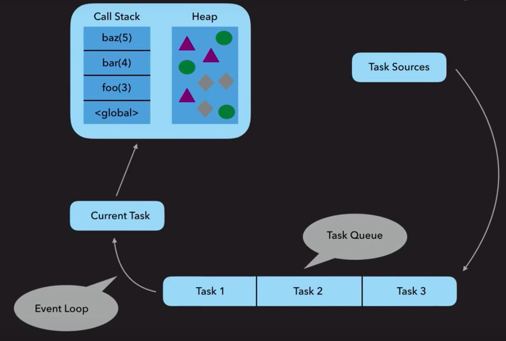
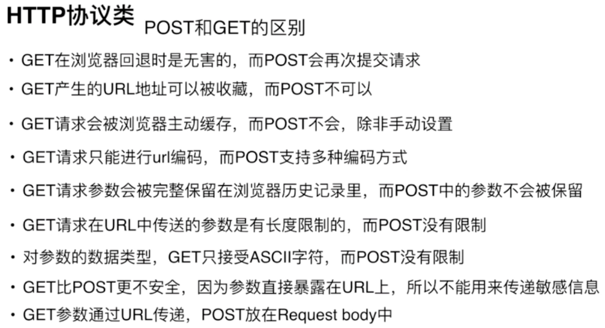
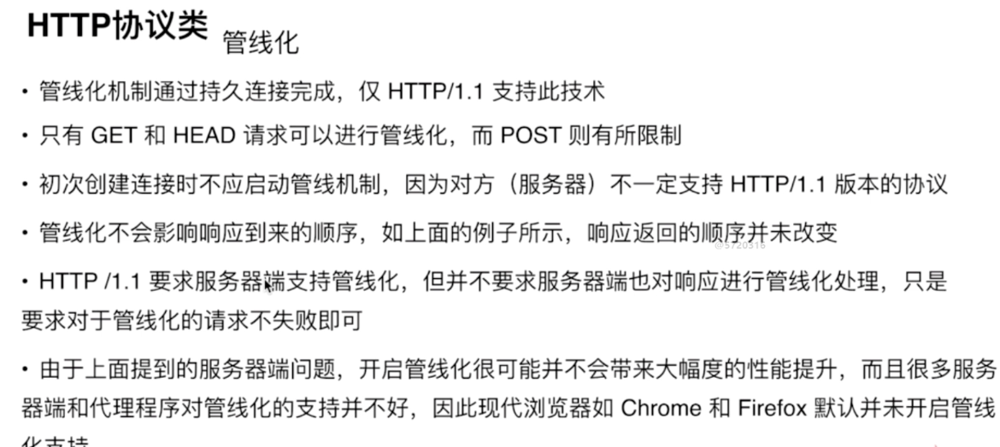
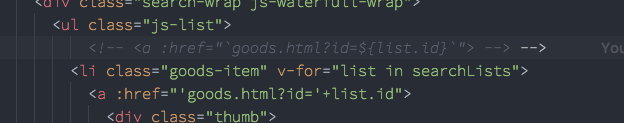
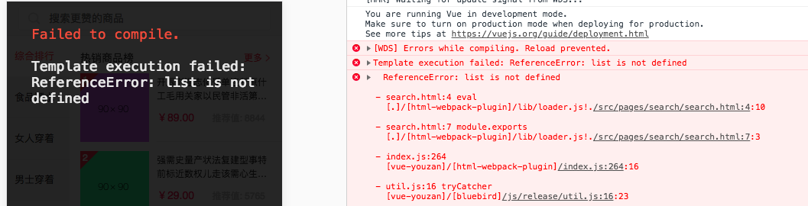
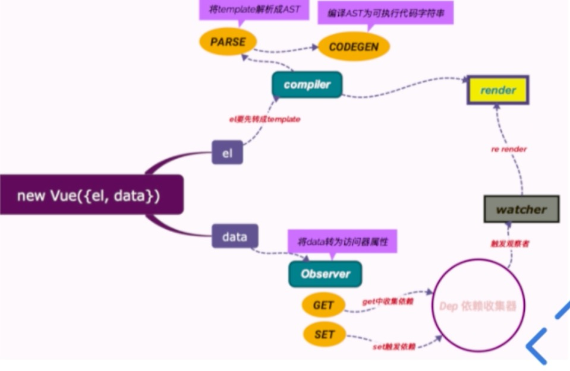
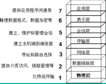

### 2018/06/30

##### Kernel&Shell

- Kernel（核），操作系统的中心，分配时间和内存；处理文件存储和通讯以响应系统的调用。
- Shell（壳），一种用户与kernel之间的接口。

##### POSIX

- Portable Operating System Interface 
- 一种标准，定义了标准API用于兼容各种系统 

##### REST

- Representational State Transfer
- 一种万维网软件架构风格
- 目的是便于软件/程序在网络中传递数据
- 基于HTTP之上而确定的一组约定和属性

##### Snapchat

##### http cache strategy

- [https://segmentfault.com/a/1190000008956069](https://segmentfault.com/a/1190000008956069)
- https://zhuanlan.zhihu.com/p/23299600?refer=study-fe

##### shell scripting

- [https://github.com/qinjx/30min_guides/blob/master/shell.md](https://github.com/qinjx/30min_guides/blob/master/shell.md)
- [https://www.shellscript.sh/](https://www.shellscript.sh/)

##### JavaScript design pattern

- [http://wiki.jikexueyuan.com/project/javascript-design-patterns/mvc.html](http://wiki.jikexueyuan.com/project/javascript-design-patterns/mvc.html)
- [https://addyosmani.com/resources/essentialjsdesignpatterns/book/#detailmvc](https://addyosmani.com/resources/essentialjsdesignpatterns/book/#detailmvc)

### 2018/07/01

##### Lisp系语言（函数式编程范式）

- [http://www.ruanyifeng.com/blog/2010/10/why_lisp_is_superior.html](http://www.ruanyifeng.com/blog/2010/10/why_lisp_is_superior.html)

##### 算法语言Scheme

- [https://r6rs.mrliu.org/](https://r6rs.mrliu.org/)

##### SICP课程/PPT/习题集

- [http://groups.csail.mit.edu/mac/classes/6.001/abelson-sussman-lectures/](http://groups.csail.mit.edu/mac/classes/6.001/abelson-sussman-lectures/)
- [http://www.math.pku.edu.cn/teachers/qiuzy/progtech/MIT_slides/](http://www.math.pku.edu.cn/teachers/qiuzy/progtech/MIT_slides/)
- [http://sicp.readthedocs.io/en/latest/](http://sicp.readthedocs.io/en/latest/)
- [http://numbbbbb.com/2016/03/28/20160328_%E6%88%91%E5%A6%82%E4%BD%95%E7%94%A8%E4%B8%A4%E5%91%A8%E6%97%B6%E9%97%B4%E5%88%B7%E5%AE%8C%20SICP/](http://numbbbbb.com/2016/03/28/20160328_%E6%88%91%E5%A6%82%E4%BD%95%E7%94%A8%E4%B8%A4%E5%91%A8%E6%97%B6%E9%97%B4%E5%88%B7%E5%AE%8C%20SICP/)

##### Linked List

- [https://codeburst.io/js-data-structures-linked-list-3ed4d63e6571](https://codeburst.io/js-data-structures-linked-list-3ed4d63e6571)

##### 时空复杂度

- [https://blog.csdn.net/zolalad/article/details/11848739](https://blog.csdn.net/zolalad/article/details/11848739)

##### Generator

- [https://gu.illau.me/posts/polyfilling-generators/](https://gu.illau.me/posts/polyfilling-generators/)

##### Underscore 整体架构

- [https://github.com/hanzichi/underscore-analysis/issues/27](https://github.com/hanzichi/underscore-analysis/issues/27)

### 2018/07/02

##### Javascript类型检查

- [https://webbjocke.com/javascript-check-data-types/](https://webbjocke.com/javascript-check-data-types/)

```javascript

//check Array

function isArray(value){

	return typeof value === ‘object’ && value instaceof Array //用constructor来判断容易伪造

}

Array.isArray(value)

//check null

function isNull(value){

	return value === null

}

//check NaN

isNaN(value)
```

##### vim替换
- [http://tanqisen.github.io/blog/2013/01/13/vim-search-replace-regex/](http://tanqisen.github.io/blog/2013/01/13/vim-search-replace-regex/)
- [http://vimregex.com/](http://vimregex.com/)
##### SDK
##### DP(dynamic programming)

- 把一个问题划分成若干子问题，相同的子问题只需解决一次进而减少了计算量。

##### jj

```

:imap jj <Esc>

```

### 2018/07/03

##### why primitive type of string instanceof String is false but can inherit method from prototype chain

- [https://javascriptrefined.io/the-wrapper-object-400311b29151](https://javascriptrefined.io/the-wrapper-object-400311b29151)
- [https://hacks.mozilla.org/2012/12/performance-with-javascript-string-objects/](https://hacks.mozilla.org/2012/12/performance-with-javascript-string-objects/)

##### requestAnimationFrame

- [https://javascript.ruanyifeng.com/htmlapi/requestanimationframe.html](https://javascript.ruanyifeng.com/htmlapi/requestanimationframe.html)
- [https://hacks.mozilla.org/2011/08/animating-with-javascript-from-setinterval-to-requestanimationframe/](https://hacks.mozilla.org/2011/08/animating-with-javascript-from-setinterval-to-requestanimationframe/)

### 2018/07/04

##### how browsers work
- [https://medium.com/@ramsunvtech/behind-browser-basics-part-1-b733e9f3c0e6](https://medium.com/@ramsunvtech/behind-browser-basics-part-1-b733e9f3c0e6)
- [https://coolshell.cn/articles/9666.html](https://coolshell.cn/articles/9666.html)
- [https://blog.sessionstack.com/how-javascript-works-the-rendering-engine-and-tips-to-optimize-its-performance-7b95553baeda](https://blog.sessionstack.com/how-javascript-works-the-rendering-engine-and-tips-to-optimize-its-performance-7b95553baeda)
- [https://www.html5rocks.com/zh/tutorials/internals/howbrowserswork/](https://www.html5rocks.com/zh/tutorials/internals/howbrowserswork/)


##### 数组去重

-   [https://github.com/mqyqingfeng/Blog/issues/27](https://github.com/mqyqingfeng/Blog/issues/27)
- [https://github.com/huangchucai/My-Note-Blog/issues/13](https://github.com/huangchucai/My-Note-Blog/issues/13)
  
##### Persistence data

- [https://www.datastax.com/dev/blog/what-persistence-and-why-does-it-matter](https://www.datastax.com/dev/blog/what-persistence-and-why-does-it-matter)


### 2018/07/05

##### <a href='../img/guide for learning computer language.png'>语言学习指南</a>

##### [项目结构目录](https://www.dropbox.com/s/7c2v7es1dg3c730/Screenshot%202018-07-05%2001.25.05.png?dl=0)

##### bindRight实现
-   https://code.h5jun.com/qig/edit?js,console

  ```javascript
  Function.prototype.bindRight = function(thisObj, ...values){
    let fn = this, len = fn.length - values.length;
    return function(...args){
      let rest = [], rargs = values.reverse();
      
      if(len > 0){
        rest = args.slice(0, len);
      }

      return fn.apply(thisObj, rest.concat(rargs));
    }
  }

  console.log(["2","3","4"].map(parseInt));

  console.log(["2","3","4"].map(parseInt.bindRight(null, 10)));

  function add(x, y, z){
      return 100*x + 10 * y + z;
  }

  let add1 = add.bind(null, 1, 2);
  let add2 = add.bindRight(null, 1, 2);

  console.log(add1(3)); //123
  console.log(add2(3)); //321
  ```

  ​

##### 倒计时动画
- https://code.h5jun.com/vix/edit?js,output
- https://code.w3ctech.com/detail/239

##### 月影code
- https://code.w3ctech.com/465?page=3
- https://code.w3ctech.com/465?page=2
- https://code.w3ctech.com/465?page=1

##### CSS水平、垂直居中
- https://sokrati.com/csswarriors/css-horizontal-vertical-centering/
- http://louiszhai.github.io/2016/03/12/css-center/

##### eventloop
- https://itnext.io/how-javascript-works-in-browser-and-node-ab7d0d09ac2f
- https://hackernoon.com/understanding-js-the-event-loop-959beae3ac40


### 2018/07/06

##### CSS3 3D transforms

- https://3dtransforms.desandro.com/


##### Dynamic vs Static, Strong vs Weak

- Dynamic versus static is about when to check for types, strong versus weak is about how serious do you get while checking the types.
- JS is dynamic and weak language.
- Dynamic means checking the types and looking for type errors during runtime.On the contrary, statics does during compile time.
- Weak means allowing implicit conversion. Strongs is opposite.
- https://www.youtube.com/watch?v=C5fr0LZLMAs

##### 有趣的JS教程

- https://www.youtube.com/watch?v=muFql8Z4sCg&list=PL-xu4i_QDSxcoDNeh8rx5-pHCCTOg0XsI
- https://en.hexlet.io/courses/intro_to_programming

##### 深入JS动态、弱类型特性

- https://dzone.com/articles/understanding-loose-typing-jav
- [https://medium.com/@gaperton/typescript-static-or-dynamic-64bceb50b93e](https://medium.com/@gaperton/typescript-static-or-dynamic-64bceb50b93e)
- https://softwareengineering.stackexchange.com/questions/122205/what-is-the-supposed-productivity-gain-of-dynamic-typing


### 2018/07/07

##### package-lock.josn

- https://medium.com/@Quigley_Ja/everything-you-wanted-to-know-about-package-lock-json-b81911aa8ab8


### 2018/07/08
  ​
##### 封装类型检查函数

  ```javascript
  function checkType(data){
    return Object.prototype.toString.call(data).match(/\b([a-z]+)\]/i)[1]
  }
  ```

### 2018/07/10

##### Array.prototype.insert

- Chrome console支持，但是目前ES6不支持
- insert(val, index) => return 改变后的array

```javascript
//自己写个polyfill
Array.prototype.insert = function(v, i){
  return Array.prototype.splice.call(this, i, 0, v)
}
```

##### TDD

- Test-Driven Development - 测试驱动开发
- https://coolshell.cn/articles/3649.html
 

### 2018/07/11

##### Visualizing  js runtime

- http://latentflip.com/loupe

##### Asynchrony: Under the Hood

- https://www.youtube.com/watch?v=SrNQS8J67zc

  - 

  - **current task** come off **event queue** and it’s location is stored in **memory** while relevant variables populate the **heap**

  - the **task queue** is populated by **task sources**, any one of which would be a particular chunk of code in an executing program

  - callback

    - 适合简单处理单个异步请求
    - 函数套函数的写法不直观，代码可读性太差
    - 多层嵌套而引发的回调地狱
    - 控制反转引发信任问题

  - promises

    - 异步处理的一种新的机制

    - 链式处理异步，线性、直观

    - 错误处理不够优雅，无法通过try catch捕捉错误，同步异步错误传播要分开捕获（与下面async比较）

      ```javascript
      const asyncFunction = () => {
        try{
          doSynchronousThings()
          return getSomeData()
          	.then(data => data.map(item => item.doSomething()))
          	.catch(e => console.error(e))
        }catch(err){
          console.error(err)
        }
      }
      ```

      ​

  - generators

    - `*`语法
    - 生成器返回可迭代对象
    - 可迭代对象通过`.next`获取`yield`出来的值
    - ​

  - async/await

    - 更简洁的异步处理方式

    - await calls operate sequentially（异步操作有序化）

    - 更优雅的错误处理try catch（与上promises比较）

      ```javascript
      const asyncFunction = async () => {
        try{
          doSynchronousThings()
          const data = await getSomeData()
          return data.map(item => item.doSomeThing())
        }catch(err){
          console.error(err)
        }
      }
      ```


### 2018/07/12

##### 闭包

- Ecam-262标准中没有closure（闭包）的定义，因为闭包是计算机语言的一种特性吧，见维基百科

- MDN：A *closure* is the combination of a function and the lexical environment within which that function was declared
- WIKIPEDIA：In [programming languages](https://en.wikipedia.org/wiki/Programming_language), a **closure** (also **lexical closure** or **function closure**) is a technique for implementing [lexically scoped](https://en.wikipedia.org/wiki/Lexically_scoped) [name binding](https://en.wikipedia.org/wiki/Name_binding) in a language with [first-class functions](https://en.wikipedia.org/wiki/First-class_function). [Operationally](https://en.wikipedia.org/wiki/Operational_semantics), a closure is a [record](https://en.wikipedia.org/wiki/Record_(computer_science)) storing a [function](https://en.wikipedia.org/wiki/Function_(computer_science))[[a\]](https://en.wikipedia.org/wiki/Closure_(computer_programming)#cite_note-1) together with an environment.[[1\]](https://en.wikipedia.org/wiki/Closure_(computer_programming)#cite_note-2) The environment is a mapping associating each [free variable](https://en.wikipedia.org/wiki/Free_variable) of the function (variables that are used locally, but defined in an enclosing scope) with the [value](https://en.wikipedia.org/wiki/Value_(computer_science)) or [reference](https://en.wikipedia.org/wiki/Reference_(computer_science)) to which the name was bound when the closure was created.[[b\]](https://en.wikipedia.org/wiki/Closure_(computer_programming)#cite_note-3) A closure—unlike a plain function—allows the function to access those *captured variables* through the closure's copies of their values or references, even when the function is invoked outside their scope.
- EcmaScript 2015 - lexical environment


- 广义的闭包：函数与它的词法作用域
  - 所以任何函数都是一个闭包
  - 发想：只要在栈中/队列中的函数，它的词法环境就得保存，那么整条词法作用域链就得保存（GC如果清除链上任何一环的上下文变量，由于JS编译执行的特性只有当队列中的函数入栈时才会分析该函数上下文中变量有哪些引用，所以得保存整条作用域链的完整）
- 狭义的闭包（实际使用）
  - 函数在它声明的作用域外调用，且函数内部有外部变量的访问且是调用环境无法访问的变量
  - 原理：词法作用域
  - 目的：隐藏变量
  - 用途：模块化
- https://github.com/getify/You-Dont-Know-JS/blob/master/scope%20%26%20closures/ch5.md
- https://developer.mozilla.org/en-US/docs/Web/JavaScript/Closures
- [closure wikipedia](https://en.wikipedia.org/wiki/Closure_(computer_programming))


##### 动态作用域

- 在函数调用时确定上下文，区别于在函数声明时确定上下文（词法作用域）
- this就是动态作用域的应用(非箭头函数中的this)


### 2018/07/13

##### bind polyfill

```Javascript
if (!Function.prototype.bind) {
	Function.prototype.bind = function(oThis) {
		if (typeof this !== "function") {
			// closest thing possible to the ECMAScript 5
			// internal IsCallable function
			throw new TypeError( "Function.prototype.bind - what " +
				"is trying to be bound is not callable"
			);
		}

		var aArgs = Array.prototype.slice.call( arguments, 1 ),
			fToBind = this,
			fNOP = function(){},
			fBound = function(){
				return fToBind.apply(
					(
						this instanceof fNOP &&
						oThis ? this : oThis
					),
					aArgs.concat( Array.prototype.slice.call( arguments ) )
				);
			}
		;

		fNOP.prototype = this.prototype;
		fBound.prototype = new fNOP();

		return fBound;
	};
}
```


##### 软绑定

- https://github.com/getify/You-Dont-Know-JS/blob/master/this%20%26%20object%20prototypes/ch2.md

```Javascript
if (!Function.prototype.softBind) {
	Function.prototype.softBind = function(obj) {
		var fn = this,
			curried = [].slice.call( arguments, 1 ),
			bound = function bound() {
				return fn.apply(
					(!this ||
						(typeof window !== "undefined" &&
							this === window) ||
						(typeof global !== "undefined" &&
							this === global)
					) ? obj : this,
					curried.concat.apply( curried, arguments )
				);
			};
		bound.prototype = Object.create( fn.prototype );
		return bound;
	};
}

function foo() {
   console.log("name: " + this.name);
}

var obj = { name: "obj" },
    obj2 = { name: "obj2" },
    obj3 = { name: "obj3" };

var fooOBJ = foo.softBind( obj );

fooOBJ(); // name: obj

obj2.foo = foo.softBind(obj);
obj2.foo(); // name: obj2   <---- look!!!

fooOBJ.call( obj3 ); // name: obj3   <---- look!

setTimeout( obj2.foo, 10 ); // name: obj   <---- falls back to soft-binding
```


##### RPC


##### 红黑树


##### Behavior Delegation


##### OLOO(Objects Linked to Other Objects)


### 2018/07/14

##### 一刷《你不知道的javascript（上卷）》

- https://github.com/getify/You-Dont-Know-JS

##### OOP VS OLOO


##### class带来的隐患


##### JSON.stringify(target, replacer)


##### document.all

- 作为假值对象 — falsy value
- 老版本IE为真值对象，故用以区分


### 2017/07/15

##### ~x大致等于-(x+1)


##### == vs ===

- 前者允许隐式强制类型转换，后者不允许


### 2017/07/16

##### 并行


##### 并发


##### 回调

- 解决不调用的信任问题

```js
function timeoutify(fn,delay) {
	var intv = setTimeout( function(){
			intv = null;
			fn( new Error( "Timeout!" ) );
		}, delay )
	;

	return function() {
		// timeout hasn't happened yet?
		if (intv) {
			clearTimeout( intv );
			fn.apply( this, [ null ].concat( [].slice.call( arguments ) ) );
		}
	};
}

// using "error-first style" callback design
function foo(err,data) {
	if (err) {
		console.error( err );
	}
	else {
		console.log( data );
	}
}

ajax( "http://some.url.1", timeoutify( foo, 500 ) );
```


- 确保异步执行

```js
function asyncify(fn) {
	var orig_fn = fn,
		intv = setTimeout( function(){
			intv = null;
			if (fn) fn();
		}, 0 )
	;

	fn = null;

	return function() {
		// firing too quickly, before `intv` timer has fired to
		// indicate async turn has passed?
		if (intv) {
			fn = orig_fn.bind.apply(
				orig_fn,
				// add the wrapper's `this` to the `bind(..)`
				// call parameters, as well as currying any
				// passed in parameters
				[this].concat( [].slice.call( arguments ) )
			);
		}
		// already async
		else {
			// invoke original function
			orig_fn.apply( this, arguments );
		}
	};
}

function result(data) {
	console.log( a );
}

var a = 0;

ajax( "..pre-cached-url..", asyncify( result ) );
a++;
```


### 2018/07/17

##### Promise.resolve(value)

- 无论value是普通值、可信亦或是不可信的thenable，都会封装为可信任的thenable

##### Promise第一个参数命名为resolve比fulfill准确

- resovle(value)，当value为thenable或者Promise时，不管是fulfilled或者是rejected状态都可以处理并且展开，所以如果命名为fulfill就会有歧义了
- 所以resolve具有duality(二元性)

##### generator

- next()与yield组成双向消息传递系统
  - yield表达式可以发送消息响应next()调用，next()也可以向暂停的yield表达式传值
  - 执行next()发起询问‘生成器下一个给我的值是？’，yield表达式回答


### 2018/07/18

##### Math.hypot(arr)

- 数组每一项平方和的开方


##### git revert vs git reset vs git checkout

- https://www.atlassian.com/git/tutorials/resetting-checking-out-and-reverting
- 都可以用来撤销对repo的变动
  - git checkout
    - 改变head指针的指向
    - 用于快速查看项目之前的各个版本/做一些实验性的改动，如果要保留就新建分支
    - commits和files级别操作
  - git reset
    - 改变head指针指向，使‘三棵树’的状态都指向该commit
  - git revert
    - 指向指定commit，只能commit级别，无法进行files级别操作
    - 不重写历史，远程仓库使用最安全

    

### 2018/07/19

##### ruby

- http://ruby-doc.com/docs/ProgrammingRuby/

##### 《Clean Code》

- https://www.investigatii.md/uploads/resurse/Clean_Code.pdf
- 经典必读，今年完成一刷

##### git合并分支

- git merge
  - https://git-scm.com/book/zh/v2/Git-%E5%88%86%E6%94%AF-%E5%88%86%E6%94%AF%E7%9A%84%E6%96%B0%E5%BB%BA%E4%B8%8E%E5%90%88%E5%B9%B6
- git rebase
  - https://git-scm.com/book/zh/v2/Git-%E5%88%86%E6%94%AF-%E5%8F%98%E5%9F%BA
  - 更线性的历史
  - 原则：只对尚未推送或分享给别人的本地修改执行rebase操作清理历史，从不对已推送至别处的提交执行变基操作
  - 用于合并分支
  - 用于重写历史
- git cherry-pick
  - https://git-scm.com/book/zh/v2/%E5%88%86%E5%B8%83%E5%BC%8F-Git-%E7%BB%B4%E6%8A%A4%E9%A1%B9%E7%9B%AE
  - https://juejin.im/post/5925a2d9a22b9d0058b0fd9b
  - https://www.jianshu.com/p/08c3f1804b36

##### git flow

- http://www.ruanyifeng.com/blog/2015/12/git-workflow.html
- https://www.git-tower.com/learn/git/ebook/en/command-line/advanced-topics/git-flow

##### named and positional parameters
- https://medium.com/dailyjs/named-and-optional-arguments-in-javascript-using-es6-destructuring-292a683d5b4e
- http://2ality.com/2011/11/keyword-parameters.html
- C# named parameters simulation

### 2018/07/20

##### destructing and parameters handling

- http://2ality.com/2015/01/es6-destructuring.html

##### ES6 module

- http://2ality.com/2014/09/es6-modules-final.html

##### generator感悟

- next()的作用
  - 迭代器迭代一次
  - 获取内部yield出来的值
- yield的作用
  - 暂停生成器——控制权转移
  - 获取外部next(val)传进来的val
- 通过next()与yield之间消息（值）的相互传递实现双向消息传递系统

##### right associativity

- ternary operator

```js
var foo = true ? false : true ? 2 : 3 // output is false not 3 because of right to left associativity

// 左结合性就是同种运算符（优先级相同运算符更准确）之间是从左到右解析的，就像下面利用小括号
var foo = (true ? false : true) ? 2 : 3 // 3

// 右结合性就是同种运算符之间是从右到左解析，如开始的例子，相当于在后面加了小括号
var foo = true ? false : (true ? 2 : 3) // false
```

##### operator precedence

- https://developer.mozilla.org/en-US/docs/Web/JavaScript/Reference/Operators/Operator_Precedence
- 运算符优先级是在太重要，故创造口诀以便记忆
- 口诀
  - 优先级由小到大
     - 逗耶佛跳逻 位等英比...
  - 优先级由大到小
     - 括属牛call...
  - 太多编不下去了ORZ

##### 算法学习路径

1. 高等数学
   - [《普林斯顿微积分读本》](https://zhuanlan.zhihu.com/p/31199228)
   - [《单变量微积分》David Jarison](https://ocw.mit.edu/courses/mathematics/18-01-single-variable-calculus-fall-2006/video-lectures/)
   - [麻省理工公开课的《单变量微积分》](https://ocw.mit.edu/courses/mathematics/18-01sc-single-variable-calculus-fall-2010/index.htm)
   - [如何学好高等数学](https://www.zhihu.com/question/20587989)

2. 离散数学
   - [《离散数学导学》](https://book.douban.com/subject/1231286/)
   - [《离散数学及其应用》](https://book.douban.com/subject/26316200/)

3. 初步了解
   - 《算法图解》
   - 《算法基础》

4. [《算法》](https://book.douban.com/subject/19952400/)

5. [《算法导论》](https://book.douban.com/subject/20432061/)

6. 参考
   - https://www.zhihu.com/question/21318658
   - https://www.zhihu.com/question/19981544

##### Java

- 静态强类型
- 基于类
- 类：一类对象的抽象，包括状态和方法
- 对象是类的实例
- Java程序的基本结构：类与类之间的关系，具体类对象之间的交互

### 2018/07/21

##### VIM Marks

- Marks
   - **`.** 跳到最后一次修改的位置
   - **``** 跳回上一次的位置

```js
:marks - list of marks
ma - set current position for mark A
`a - jump to position of mark A
y`a - yank text to position of mark A
```

##### 很全的VIM速查卡

- https://coolshell.cn/articles/5479.html

##### IDE + VIM 感想

- 纵向
   - VIM是一种思想、哲学，不易过时
   - 一次学习，长久受用
   - 越用挖掘越深，越能提升效率 
- 横向
   - VIM是一种编辑模式
   - 与各种IDE配合，既能发挥VIM无鼠标操作的流畅感，又能享用IDE自身特性
   - 学习各种语言时自带熟悉的操作感

### 2018/07/22

##### VIM tricks and tips

- http://vim.wikia.com/wiki/Best_Vim_Tips

##### overview about 10 languages

- https://www.youtube.com/watch?v=7bE2mI4ePeU

##### how the internet works ( 47 minutes )

- https://www.youtube.com/playlist?list=PLzdnOPI1iJNfMRZm5DDxco3UdsFegvuB7

##### how computers work ( 27 minutes )

- https://www.youtube.com/playlist?list=PLzdnOPI1iJNcsRwJhvksEo1tJqjIqWbN-
- core task
   - input
   - storage
   - processing
   - output
- binary number system
   - ones or zeros ( electrical signal, on or off )
   - decimal number convert to binary number
   - all information media can convert to number
      - text
         - like ASCII Unicode
      - image and vedio
         - image -> consist of pixels -> RGB -> number
         - vedio -> 30 images per seconds
      - sound
         - sound is a seriers of vibrations in the air
         - vibrations can be represented graphically as a waveform
         - any point on the waveform can be represented by a number

##### How Not to Get Hacked

- https://code.org/curriculum/csp/docs/hownottogethacked

### 2018/07/23

##### about cryptography

- PKI(public key infrastructure)
   - confidentiality 
   - 公钥加密（public-key crytography）又称非对称加密（asymmetric cryptography）
- 简单分析A向B发送消息过程
   - A手握自己的私钥与B的公钥
     - 私钥为了确认身份，B手上A的公钥只能解密经过A私钥加密的信息
     - 公钥是为了保密性，经过B公钥加密的信息只有B的私钥才能解密
   - B手握自己的私钥与A的公钥
   - A用私钥加密再用公钥加密
   - B拿到消息先用A的公钥解密来做验证消息来源
   - B再用私钥解密消息内容
   - 其中存在如何确保公钥真实性的问题，见下文
- digital signature certificate
   - integrity -> 完整性
   - authenticity -> 真实性
   - non-repudiation -> 不可否认性
   - 数字签名证书由信任第三方CA发布
   - 假设有三方CA，A，B
      - CA用自己的私钥加密A的公钥及其它相关信息生成数字证书
      - A发送消息给B时附上数字证书
      - B通过CA的公钥（CA公钥内置在浏览器、操作系统）解码数字证书获取可信的A的公钥
- 其它
    
    ```js
    非对称加密作为破解难度更大的加密方式，一般也只用作某个对称加密算法的密钥传递信道，以获取加密效率和安全性的平衡
    
    未来可能使用量子通信做为更高级的信道派发公钥
    ```
   - 上文理解为：现实中先是采取非对称加密建立可靠连接来传送对称加密的公钥，最后使用对称加密来进行连接通信，这样在确保了安全性的基础上保证了效率
- SSH
   - Secure Shell
   - 作用
      - 远程登录服务器
      - 使用命令行接口
   - 使用非对称加密技术
      - 加密算法有很多种，如RSA、DSA、ED25519等
   - 所以起名很形象：安全的shell
- https://www.youtube.com/watch?v=G7hs-3R86M0
- https://www.youtube.com/watch?v=y2SWzw9D4RA
- http://www.ruanyifeng.com/blog/2011/08/what_is_a_digital_signature.html
- https://www.zhihu.com/question/47232448


### 2018/07/24

##### duplex
- full duplex
   - 双方在数据传输的过程中，同一时间允许双向传输（即收发）
   - 如手机通话
- half duplex
   - 双方能够通讯，但不同时，即同一时间只允许收或者发讯息
   - 如对讲机

##### 数字证书原理

- http://www.cnblogs.com/JeffreySun/archive/2010/06/24/1627247.html#!comments

##### TCP那些事儿（上）- coolshell

- https://coolshell.cn/articles/11564.html

### 2018/07/25

##### CIDR与IP地址

- http://uule.iteye.com/blog/2102484
- https://www.waitig.com/cidr%E7%9A%84ip%E5%9C%B0%E5%9D%80%E7%9A%84%E8%A1%A8%E7%A4%BA%E4%B8%8E%E5%88%92%E5%88%86%E6%96%B9%E6%B3%95.html

### 2018/07/26

##### 网络连接

- TCP UDP
   - 浏览器邮件收发数据走TCP
   - DNS查询等收发较短的数据走UDP
- IP
   - ICMP
- ARP
   - MAC
- MTU
   - Maximum Transmission Unit
   - 一个网络包的最大长度，以太网的是1500字节
   - MTU = header + MSS
- MSS
   - Maximum Segment Size
   - 特指TCP数据长度
   - TCP IP头部长度一般为40字节，所以MSS长度为1460字节

##### cookie

- 作用
   - 浏览器识别用户
   - 保存一些状态信息
   - 不是用作客户端存储
- 大小
   - 4KB

### 2018/07/28

##### 二进制数组

- https://developer.mozilla.org/zh-CN/docs/Web/JavaScript/Typed_arrays

##### lodash深拷贝

- http://07lyt.com/2016/12/14/%E8%87%AA%E5%B7%B1%E5%AE%9E%E7%8E%B0clonedeep/
- http://jerryzou.com/posts/dive-into-deep-clone-in-javascript/

### 2018/09/07

##### Cookie vs Session

- 目的
    - 只是为了区分用户就用Cookie
    - 记录用户的私密信息时，用Session
- 实现原理
    - 响应时设置`Set-Cookie`头，此为HTTP协议层面的技术，存储在浏览器端
    - 而Session不是HTTP协议层面的技术，存储在服务器端，不同的后端框架实现机制不同，一般存在内存（不建议）、文件、数据库
- 关系
    - Session一般基于Cookie，但是不绝对
    - Session可以放在localStorage，需要的时候用JS读取在带到request header里
    - Session还可以作为查询参数放在url里
- 参考
    - http://book.jirengu.com/fe/%E5%89%8D%E7%AB%AF%E5%9F%BA%E7%A1%80/Javascript/%E5%AD%98%E5%82%A8.html

##### flex layout

- flex container properties
    - flex-direction
        - row(default)
        - row-reverse
        - column
        - column-reverse
    - flex-wrap
        - nowrap(default)
        - wrap
        - wrap-reverse
    - flex-flow
    - justify-content
    - align-items
    - align-content
- flex item properties
    - flex-grow
    - flex-shrink
    - flex-basis
    - flex
    - order
    - align-self

### 2018/09/13

#### 获取页面元素位置

- 获取元素在页面中的绝对位置

```js
//method one
function getAbsolutePositionY(element){
    let y = element.offsetTop
    while(element.offsetParent !== null){
        element = element.offsetParent
        y += element.offsetTop
    }
    return y
}
//menthod two
element.getBoundingClientRect().top + document.documentElement.scrollTop
```

- DOM元素属性

```js
//高
element.scrollHeight
element.clientHeight
element.offsetHeight

//距离
element.scrollTop //需要元素内容产生进度条，否则为0
element.offsetTop //element.offsetParent获取定位父容器（否则为body，但为body时，offsetTop包含至body的margin）

//获取封装了元素左上角与右下角到viewport左上角距离等数据的对象
element.getBoundingClientRect()


```

- BOM核心对象属性、方法

```js
//属性
window.innerHeight
window.scrollY

//方法
window.scrollTo(x, y)
window.scrollBy(x, y)

```

- 参考
    - http://www.ruanyifeng.com/blog/2009/09/find_element_s_position_using_javascript.html
    - http://js.jirengu.com/qaxij/1/edit?html,css,js,output
    - http://js.jirengu.com/puqab/2/edit?html,css,js,console,output

### 2018/09/14

#### JS打开新标签页

```js
window.open('http://www.baidu.com')

$('body').append('<a href="" id="goto" target="_blank"></a>');
$('#goto').attr('href', _href);
$('#goto').get(0).click();
```

### 2018/09/16

#### 相对line-height中 无单位值 vs 百分比值 的继承

- 无单位值的继承是继承这个无单位值，后代元素再根据自身的`font-size`再计算出绝对值
- 百分比值是计算出绝对值后给后代元素继承

### 2018/09/17

#### webpack骨架

```js
module.exports = {
    entry: {}, //入口
    output: {  //输出
        path: path.resolve(__dirname, 'dist'),
        filename: ''
    },
    module: {  //预处理
        rules: [
            {
                test: /\.jsx?$/,
                use: []
            }
        ]
    },
    plugins: {},  //贯彻整个生命周期的
    resolve: {
        alias: ''
    }
}
```

### 2018/09/19

#### prettier - 格式化规则设置
- https://prettier.io/docs/en/index.html

#### display:flex一定放到max-width下面，否则max-width失效（tips：display:flex都发最下面以防意外）

### 2018/09/21

#### 几个`input`相关的伪类`:valid` `:invalid` `:required`

```js
//都要配合input元素required属性使用，否则会出现奇怪现象
//权重 :required >:valid 与 :invalid
//:valid 与 :invalid规则应该是互斥的

//先上一个使用场景: 需要切换input中有无内容时的状态，只用:valid

//1.只要有:invalid，不匹配规则即激活（e.g.该伪类下设置字体红色，只要输入字体为红色，比较奇怪，可能后续会扩展功能），还没有想到使用场景
//2.:required，标记位required属性的input激活
```
- [demo](http://jsbin.com/nutemiz/edit?html,css,output)

#### SCSS summary

- history
    - 源于Ruby编译成CSS的脚本语言，所以语法类似Ruby，包含了脚本语言的基本概念，如：变量声明、各种条件、循环控制语句等等

- basic
    - nested rules
    - `&` represent parent class
    - attribute nested
    - `//` anotation doesn't compile in css
- caculate
    - `$` is variables prefix
    - `#{}` interpolation liked ES6 `${}` placeholder
    - `+-*/`
    - `18px/20px` liked no used `/`
- static directive
    - `@` is SCSS directive signal 
    - `@import`
    - `@extend`
- mixin directive
    - `@mixin` defines name represents a group of key-values and using `@include` the name defined by `@mixin` reference
- control directive
    - `@if` `@else if`
    - `@for $i from 1 to 10`
    - `@for $i from 1 through 10`
    - `@each $n in x1, x2, x3`
    - `@while $foo < 10`
- function directive
    - `@function name(){@return }`
    - function body allows to use control directives but function directive


### 2018/09/26

#### `insertAdjacentHTML`性能更好


### 2018/09/28

#### Vue数据通讯
- props down event up
    - 父子组件通讯
        - $parent
        - ref 
- global bus
    - 非父子组件通讯
- vuex
    - 复杂的数据通讯
- localStorage

### 2018/09/29

#### object-path

- 使用path来获取很深的属性的库


### 2018/09/30

#### dom遍历的BFS与DFS

- https://blog.csdn.net/shuidinaozhongyan/article/details/70325551
- https://blog.csdn.net/WickedDogg/article/details/72150040

#### dns-prefetch

#### 双核浏览器优先使用webkit

```html
<meta name=renderer content=webkit>
```

#### npm script

- https://michael-kuehnel.de/tooling/2018/03/22/helpers-and-tips-for-npm-run-scripts.html
- http://www.infoq.com/cn/news/2016/02/gulp-grunt-npm-scripts-part2


### 2018/10/01

#### pre vs xmp vs code 

- 浏览器可以解析pre标签里的空格数量，但不能包含HTML元素（即不能在里面写HTML标签）
- 浏览器把xmp标签里的所有内容当普通文本解析（即写HTML标签页当做普通文本展示）
- code标签意指里面的内容为计算机代码，浏览器会添加默认样式

#### table layout
- `display: table`的元素独占一行，但是宽度靠子元素撑开
- `dispaly: table-cell`的元素高度一致，取height最大

#### grid layout

- https://css-tricks.com/snippets/css/complete-guide-grid/
- http://cssgridgarden.com/
    - level24 26有点反直觉，重点是要考虑预设了5行5列
- `display: grid`元素不受浮动元素影响，并且比普通流、浮动元素与`position`非`fixed/relative/abosulte/sticky`元素的层级高（即覆盖效果）
    - [demo](https://jsbin.com/hawovac/edit?html,css,output)

#### 上下定高定位，中间自适应

- https://jsbin.com/kutujiq/3/edit?html,output

#### JS获取元素宽高

- element.style.width
- element.currentStyle.width
- window.getComputedStyle(element).width
- element.getBoundingClientRect().width

#### 块级格式化上下文(BFC) 的特性
- BFC 内的浮动不会影响到BFC外部的元素
- BFC 的高度会包含其内的浮动元素
- BFC 不会和浮动元素重叠
- 同一个BFC内的垂直margin合并

#### 创建BFC
- 浮动框
- `position`非`static`
- 非块级的块容器(inline-block)
- overflow 属性非 visible 的块框

#### BFC使用场景
- 清除浮动
- 防止margin折叠

#### 浮动（float）
- 浮动元素从常规流中脱离，被漂浮在容器(包含块)左边或右边
- 浮动盒会一直漂到其外边缘挨到容器边缘或另外的浮动盒
- 浮动元素不会影响其后面的流内块级盒
- 但是浮动元素后面的行级盒子会变短以避开浮动元素

#### DOM事件捕获流程

- `window->document->html->body->...->target`

#### event对象常见应用

- event.preventDefault
- event.stopPropagation
- event.stopImmediatePropagation
- event.currentTarget
- event.target

#### 自定义事件

```js
let e = new Event('custome')
dom.addEventListener('custome', function(){})
dom.dispatchEvent(e)

//CustomEvent vs Event，前者可以在new实例的时候传入一个对象作为第二个参数挂载在event对象上传递数据
```

#### HTTP协议get与post区别

- 

#### HTTP持久连接与管线化

- 持久连接 
    - HTTP 1.1 version才开始使用`Connection: Keep-Alive`字段建立持久连接，避免每个request/response之间都要重新建立连接，直到`Connection: Close`为止
- 管线化
    - 

```
//将请求1->响应1->请求2->响应2...
//变为多个请求与响应分别打包发送，如下
//请求1->请求2->响应1->响应2...
```

### 2018/10/02

#### MVC思考

- 根据wikipedia，经典的MVC是
    - Model作为中心，管理数据，逻辑，规则
    - View负责输出  
    - Controller负责输入
- 前端业务的MVC是
    - Model负责获取数据--ajax
    - View负责准备模板（输出）--HTML展示
    - Controller负责拼装数据（输入）--拿到Model的数据进行渲染，即要操作dom来更新数据
- 很明显前端MVC与经典MVC差异为前者的中心为Model，后者为Controller。
- 仔细思考，经典MVC应该是基于服务端，所以逻辑上与前端有所差异在所难免。另外前端MVC中事件监听放在Controller里刚好完成整个数据输入的完整逻辑。
- 所以前端的C层是最复杂的，负责模板与数据外的所有逻辑。

#### 实现继承的方法演进


### 2018/10/03

#### 跨域
- JSONP
- CORS
- WebSocket
- postMessage
- hash

#### 安全
- XSS
- CSRF

#### 常见算法类
- 排序
- 堆栈、队列、链表
- 递归
- 波兰式和逆波兰式

#### 渲染机制
- doctype
    - 告诉浏览器文档类型
    - 常用的类型有HTML5与HTML4.01（分strict与transitional；区别在于是否包含展示性与弃用元素）
- 渲染流程
    - reflow
    - repaint 

#### JS运行机制
- 单线程
- 堆栈
- 任务队列
- 事件循环

#### 页面性能

- 资源打包，减少HTTP请求
- 非核心代码异步加载
    - 动态脚本加载
    - defer
        - 加载完后，等待HTML解析完毕后，同样具有defer属性的JS按照书写顺序异步执行
    - async
        - 加载不阻塞，加载完立即执行阻塞
- 浏览器缓存
    - 强缓存不发送请求，协商缓存发送请求（名字取得好，强制与协商）
    - 强缓存
        - Expires
        - Cache-Control（权重比Expires大）
    - 协商缓存
        - Last-Modified If-Modified-Since
        - Etag If-None-Match
- DNS预解析
- 使用CDN
        
#### 错误监控
- 即时运行错误：代码报错
    - `try...catch`
    - `window.onerror`
- 资源加载错误 
    - Object.onerror（注意：资源加载错误不会冒泡）
    - performance.getEntries()捕获所有加载资源返回数组
    - Error事件捕获
- 跨域的JS运行错误监控
    - `script`标签添加`crossorigin`属性
    - JS资源响应头设置`Access-Control-Allow-Origi: 对应域/*`
- 上报错误的原理
    - 不推荐：AJAX 
    - 利用Image对象上报，代码`(new Image()).src="xxxx?xxxx"`

#### 递归与尾递归
- 递归
    - 递归在调用函数时，当前结果依赖于下一次的调用，下一次的结果又依赖于下下次直到最后一次无依赖的结果，这造成调用栈很深，空间复杂度为O(n)
- 尾递归
    - 尾递归把递归的空间复杂度由O(n)变为了O(1)
    - 递归主要是为了解决可以由n个重复的小问题累加而成的大问题，又为了解决递归调用栈太深的问题，尾递归把(每个小问题完成的部分)当前函数执行结果作为参数给到下一个问题，下次函数的调用不再与当前函数存在依赖关系，这样执行下次函数调用后上次的函数可以弹栈了。
    - 尾递归优化了内存使用，但是并没有减少整体计算量，所以时间复杂度相当，执行时间不会变快，反而可能更慢。
- [参考](https://segmentfault.com/a/1190000009857470)

### 2018/10/04

#### Promise原理思考
- 核心原理是通过then方法传入回调，内部创建回调队列，在resolve/reject的时候调用队列里的回调(重点：执行队列里的回调必须是异步的，只要如此才能获取注册的回调)，刚好把获取的数据传入。
- 链式调用实现是thenable对象的then方法会return一个新的Promise实例，这是因为一个实例对象的状态非resolved即rejected。
- 解开了一个疑惑：event loop里Promise属于microtask，`new Promise(fn).then(resolve)`里Promise的回调是同步的，then的回调是异步，under the hood终于看清了。

#### simple-promise
- https://github.com/slashhuang/simple-promise


### 2018/10/05

#### Virtual DOM
- what&why
    - DOM操作是昂贵的，JS运行是高效的
    - JS模拟DOM结构
    - DOM变化的对比，放在JS层来做（HTML CSS JS中只有JS是图灵完备语言）
    - 提高重绘性能
    - 数据结构

    ```js
    //一个层次的标签用包含tag attrs children 3个属性的JS对象表示，如下：
    {
        tag: 'div',
        attrs: {
            className: 'list'
        },
        children: [
            'xxx', //纯文本
            {
            //另外一个层级的标签，形式一样，随着层级增加而递归
            }
        ]
    }
    ```
    
- how
    - [snabbdom](https://github.com/snabbdom/snabbdom)
        - h
            - 生成DOM数据结构
        - patch
            - 分首次渲染与更新，下文介绍

- diff algorithm
    - what
        - diff算法是linux基础命令
    - why
        - 在virtual DOM中应用diff算法找出需要更新的节点
    - snabbdom的diff算法实现
        - patch(container, vnode)
            - 渲染到空DOM元素中
            - createElement实现
        - patch(vnode, newVnode)
            - 更新节点
            - updateChildren实现

#### mixed content
- 没办法，只能把http协议改成https，如果资源url不支持https则没辙


### 2018/10/06

#### MVVM与Vue
- jQuery库和框架区别
    - 数据与视图分离，解耦（开放封闭原则，对扩展开放，对修改封闭）
    - 以数据驱动视图，只关心数据变化，DOM操作被封装（开发者不关心如何渲染，由框架实现）
- 理解MVVM
    - Model - 数据、模型
    - View - 视图、模板
    - ViewModel - 连接Model与View
- Vue三要素
    - 响应式
        - 
    - 模板解析
        - 模板
            - 本质是字符串
            - 蕴含逻辑，各种指令如：v-if v-on等
            - 基于HTML，做了扩展（能嵌入JS变量）
            - 生命周期：字符串 -> JS -> HTML
    - render函数
        - render(模板数据) -> 处理逻辑，渲染为DOM节点
        - `with`
            - with体内的变量优先在with提供的对象上找

        ```js
       // usage
       obj = {a: 1, b: 2}
       a = 0
       with(obj){
         console.log(a)
         console.log(b)
       }
        ```
        
        - `vm._c` - createElement
        - `vm._v` - createTextVNode
        - `vm._s` - toString
        - `vm._l` - renderList
        - re-render时，没有get监听的属性是不被用到的，set监听无需处理，避免重复渲染


### 2018/10/09

#### 好看的渐变生成
- https://uigradients.com/#PiggyPink
- https://webgradients.com/

#### 8的倍数
- 技巧：字体与间距设置为8的倍数

#### HTML渲染
- 顺序执行，并发加载
    - 同一个域名的并发加载资源有上限，所以会有3到4个cdn分配资源
    - 词法分析
    - 并发加载
    - 并发上限
- 是否阻塞
    - CSS阻塞
    - JS阻塞
- 依赖关系
- 引入方式


### 2018/10/10

#### vue data属性中undefined/null的属性非响应

- https://github.com/vuejs/vue/issues/7087
- This is intended behavior in order to make another use case possible: class-based model objects with getter/setters defined on the prototype. Note that we explicitly recommend against using class/prototype based objects as data. The general rule of thumb is Vue's reactivity system leaves everything on the prototype chain alone because we assume the user wants the original behavior on the prototype chain.My suggestion is instead of trying to expand the missing properties post-observe (inside a watcher), do it pre-observe (before you feed the object into Vue instances) - i.e. setting all of these properties onto the object as own properties before letting Vue making it reactive.

#### slot-scope
- 插槽内外数据通讯的方式，用于通过slot标签的特性，把当前作用域的数据传递给扩充插槽的元素(通过slot-scope特性拿到)

#### 计算属性无法监听对象的变化，可以用watch监听


### 2018/10/12

#### XSS

- https://segmentfault.com/a/1190000013315450
- https://www.imooc.com/learn/812
- https://acelibin.github.io/2017/11/23/WEB%E5%AE%89%E5%85%A8%E2%80%94%E2%80%94%E4%BA%86%E8%A7%A3XSS%E5%92%8CCSRF%E6%94%BB%E5%87%BB/             

#### CSRF

- https://www.jianshu.com/p/855395f9603b
 
      
### 2018/10/13

#### 移动端开发 

- 调试工具 charles
- https://github.com/jtyjty99999/mobileTech/blob/master/README.md

#### 浏览器存储
- cookie
    - limited size 4kb
- localStorage
    - limited size 5mb or 10mb
- sessionStorage
    - same as localStorage


### 2018/10/14

#### 同源策略

- 限制范围
    - cookie、localStorage、 indexDB 无法读取
    - DOM 无法获取
    - AJAX 请求不能发送
   
#### JS生成的img请求发送时机

- 原来JS生成img，不是在插入页面后再向src发送请求，而是在设置完img.src即发送请求，见demo
- [demo](https://jsbin.com/topeniq/edit?html,js,output)

#### window.onload vs document.onload vs $(callback)

- window.onload
    - 在页面与标签上的外部资源都加载完毕才触发回调
    - 但是有的浏览器实现与document.onload一致
- document.onload 与 $(callback)
    - DOM树生成即可触发回调

#### 构造任意长度的数组

```js
// 造个长度5的数组

// 只要用fill的填充empty即可
let arr1 = Array(5).fill(0)
// 利用Array.from函数第二个回调更精确的控制每个值
let arr2 = Array.from(Array(5), (item, i) => i + 1)
```

- [更多](https://stackoverflow.com/questions/1295584/most-efficient-way-to-create-a-zero-filled-javascript-array)

#### ES6 模板字符能否替代模板引擎
- https://www.keithcirkel.co.uk/es6-template-literals/

#### 函数默认参数中的可选参数

- https://medium.com/dailyjs/named-and-optional-arguments-in-javascript-using-es6-destructuring-292a683d5b4e

#### JS 浏览器的线程

- http://imweb.io/topic/58e3bfa845e5c13468f567d5
- https://blog.csdn.net/It_rod/article/details/79880745


### 2018/10/15

#### 微信小程序
- 特点
  - 无需安装 — 包<1mb，所以用户感觉不到下载安装
  - 用完即走 — 适用低频使用的应用，用户不用管理
  - 无处不在，随时可用 — 任何服务都可以通过小程序获取
  - 适于业务逻辑简单、使用低频、性能要求低的应用
- 格局
  - 微信作为一个通讯App，内部搭建了一个平台提供给开发者，而小程序的开发成本和周期都低于Native、Hybird、webapp，这方面来说给创业者与开发者提供了便利；另一方面搭建起了一个大家共同维护的生态无疑健壮了微信这个产品的生命。可以说是相互成就，格局远大。

### 2018/10/16

#### 开放封闭原则
- 代码模块化便于维护
- 降低测试回归的工作量

#### JS运行机制总结
- 堆
- 栈
- 执行上下文
- 词法作用域
- 单线程
- event loop

#### vuex

- store
    - 构建

      ```js
      const store = new Vuex.Store({
        state: {},
        getters: {}
        mutations: {},
        actions: {},
      })
      ```
    
    - state
    - getter
        - 类似computed
    - mutation
        - 必须通过mutation的方法更改state中的数据
    - action
        - 类似mutation，不过是通过提交mutation而不是直接改变state状态
        - 可以包含任何异步
    - module
        - 当存储的对象过于庞大而臃肿时，将store分切为多个module
        
        ```js
        const moduleA = {
            state: {},
            getters: {},
            mutations: {},
            actions: {}
        }
        const moduleB = {
            state: {},
            getters: {},
            mutations: {},
            actions: {}
        }
        const store = new Vuex.Store({
            modules: {
                a: moduleA,
                b: moduleB
            }
        })
        store.state.a
        store.state.b
        ```

### 2018/10/17

#### 渲染机制
- 渲染流程
   - dom tree
       - 增量构建
   - cssom tree
       - 全量构建
   - render tree
   - layout
   - paint
- 资源对渲染的影响
   - css
       - 阻塞渲染
           - 通过link标签添加媒体查询避免非主样式加载的阻塞
           - 通过DOM API创建link标签避免阻塞
           - preload
       - 阻塞JS执行 
   - js
       - 阻塞HTML parser
       - 并行加载，顺序执行
       - 阻塞css执行，不阻塞加载
       - async defer相比较于放在body底部而言，优先加载了资源
           - async加载不阻塞HTML parser，但是下载完成立即执行，阻塞渲染
   - font
       - 阻塞渲染
   - img
       - 不阻塞

#### 性能优化目标
- 降低以下指标
    - 关键资源数量
    - 关键资源体积
    - 关键资源网络请求


### 2018/10/18

#### chunk asset通俗理解
- chunk中间状态的资源
- asset是最终要获取的资源

#### output.path vs output.publicPath
- path是经过webpack打包后的输出路径
- publicPath以服务器启动目录为根目录设置路径
- https://stackoverflow.com/questions/28846814/what-does-publicpath-in-webpack-do

#### NODE_ENV
- https://juejin.im/post/5a4ed5306fb9a01cbc6e2ee2


### 2018/10/19

#### react vs angular vs vue
- https://academind.com/learn/angular/angular-vs-react-vs-vue-my-thoughts/

#### proxychain-ng
- https://www.hi-linux.com/posts/48321.html

#### vue过滤器
- 定义

```js
// 实例化时定义
new Vue({
    filters: {
        name(){}
    }
})

// 全局定义
Vue.filter(name, function(){})
```

- 使用
    - 双花括号或者v-bind的表达式后面用管道符号链接使用
    - 流式处理表达式的返回值，可多个串联（前者的输出作为后者输入）

    ```js
    {{ expression | filterName}}
    
    v-bind:id="rawId | formatId"
    ```
    
#### vue-router
- 本质
    - 把url映射到组件树结构的过程
- router
    - history.pushState({}, '', path)
    - location.hash
- 作用
    - 跳转路径，展示不同组件，不发送请求

#### autocomplete属性
- 用于input标签是否提示之前输入过的能容并且点选入input，on为可以，off不能

#### autofocus属性
- input添加该属性，属性页面会自动聚焦至首个拥有该属性的input


### 2018/10/20

#### 通读尤大todoMVC
- https://jsfiddle.net/yyx990803/4dr2fLb7/?utm_source=website&utm_medium=embed&utm_campaign=4dr2fLb7

#### 前端发展不是太快，而是被压抑
- 2008年github面世前，缺乏平台交流共享技术
- V8引擎给JS提速，催生nodejs为前端生态化奠定基础
- 至此计算机领域的各种概念，前端才具备能力实现，促使前端迅猛发展

#### 单页应用
- URL控制视图而不触发页面刷新
- 抽象history api实现router
- router原理是根据路径寻径，展示路径对应的组件，能够细粒度控制页面展示。

### 2018/10/21

#### 用户界面的发展
- WIMP
- vista

#### 线程与进程
- 进程之间是相互独立的
- 进程由一个线程或多个线程组成
- 多个线程在进程中协作完成任务
- 同个进程中的线程共享内存
- cpu资源分配的最小单位是进程
- cpu调度的最小单位是线程

#### 良言
- 价值观决定人生方向
- 思维方式决定成长空间

#### 数据驱动组件开发
- 把问题抽象成数据
- 数据正交化
- 视图是数据的映射
- 组件必须是失血模型，即只包含数据处理，不包含业务逻辑
- 设计可以数据驱动的组件
- https://ppt.baomitu.com/d/4136e50e#/ 

### 2018/10/23

#### 数组方法
- http://louiszhai.github.io/2017/04/28/array/

#### 字符串方法
- http://louiszhai.github.io/2016/01/12/js.String/

#### vue cli 3 webpack配置
- https://segmentfault.com/a/1190000016101954

### 2018/10/25

#### 移动端UI库
- [mint-ui](https://github.com/ElemeFE/mint-ui)
- [vue-ydui](https://github.com/ydcss/vue-ydui)
- [vux](https://github.com/airyland/vux)
- [weui](https://github.com/Tencent/weui)
- [更多](https://github.com/vuejs/awesome-vue#mobile)

### 2018/10/26

#### 保留2位小数

```js
function format(n){
	return String(parseInt(Number(n)*100)).replace(/(\d{2})$/, '.$1')
}
```

#### qs
- 把查询参数转换成对象的包

#### [页面设计层级规范](https://weui.io/#layers)
- 由上到下：popout > mask > navigation > content

### 2018/10/27

#### benchmark笔记
- 获取时间api
    - node端
        > process.hrtime() // return [s, ns]
        
    - browser端
        > performance.now()

- benchmark库的改进点
    - 每个测试用例的时间都要跑1s，这是由于benchmark库诞生的年代（2010左右）的计算机时钟精度不高造成（1ms），采取大量采样取平均值的方式。现在的提供了高性能的计时器，可用`Math.min()`代替取平均(这又大大降低了取样数量)加快跑分时间
    - 手动取样设置的时间片精度可以降低，又节省了一部分时间
    - 监控获取稳定数据的循环次数，当趋于稳定时停止采样
- [参考](http://cloud.live.360vcloud.net/theater/play?roomid=2242)

#### 某些特定场景下，vue挂载的html中的注释里有js代码的语法错误会解析并报错(用模板字符串的$中的变量，作用域会有差别，结论是不要在vue模板里用模板字符串)
- 
- 


### 2018/10/28

#### new一个Vue实例的workflow
- 

#### URLSearchParams

### 2018/10/29

#### content-length
- TCP协议是没有边界的，通过HTTP协议的头部字段`content-length`定义边界

#### 网络协议
- WebSocket
 
- WebRTC

### 2018/11/03

#### [软件开发模式演进史](https://www.tapd.cn/forum/view/36971)
- 瀑布流式开发
- 敏捷开发
- scrum开发
- kanban开发
- lean开发

#### [通用研发模式演进](https://mp.weixin.qq.com/s/aEanKIwA92zTh3BP5sTwiA)
- 经典模式
    - SLB — server load balance
    - ECS — entity component system
- faas模式(function as a service)
    - event driven 事件驱动
    - stateless 无状态
    - ephemeral 瞬时性
- baas模式(backend as a service)
- serverless模式

#### WebAssembly
- http://feday.fequan.com/2017/WebAssembly%E5%9C%A8%E7%99%BD%E9%B9%AD%E5%BC%95%E6%93%8E%E7%9A%84%E5%AE%9E%E8%B7%B5.pdf
- https://ppt.baomitu.com/d/404dff0f

### 2018/11/23

#### HTTP前世今生
- https://juejin.im/post/5be935f2e51d4570813b8cf0


### 2019/01/08

#### HTML5标签分类
- https://developer.mozilla.org/en-US/docs/Web/Guide/HTML/Content_categories

#### JSON-LD
- 指定格式的JSON数据
- 结构化的数据便于数据交换
- 用于搜索引擎优化，搜索引擎直接根据JSON-LD里的数据展示在搜索结果中


### 2019/01/10

#### 移动端使用开发者工具
- 开启手机usb debugging功能，不同手机方式不一样
- 电脑chrome打开chrome://inspect
- 手机数据线连上电脑，并且用chrome打开网页
- 电脑上刚才打开的网页即可进行调试
- 整个过程中注意手机提示

#### 关键渲染路径
- https://developers.google.com/web/fundamentals/performance/critical-rendering-path/

#### CSS选择器为何从右往左匹配
- 更快的效率
- https://stackoverflow.com/questions/5797014/why-do-browsers-match-css-selectors-from-right-to-left

#### 网络协议与网络模型
- [参考](http://www.cellbiol.com/bioinformatics_web_development/chapter-1-internet-networks-and-tcp-ip/the-tcpip-family-of-internet-protocols/)
- DNS协议与ARP协议
    - DNS
        - 域名 -> IP地址
    - ARP
        - IP地址 -> MAC地址

#### URI与URL
- URL是URI的子集
- URI
    - 统一资源标识符(uniform resource identifier)
    - 统一，即遵循统一的协议方案
    - 资源，即信息的载体，可以被标识的东西
    - 标识符，用来标识资源的字符
 
#### 页面渲染与性能优化
- https://segmentfault.com/a/1190000010298038

#### TCP三次握手与四次挥手
- 三次握手
    - 意义：信道不可靠，为了确保数据传输的可靠性而建立的机制
- 四次分手
    - FIN_WAIT_1（主动方）
    - CLOSE_WAIT（被动方）
    - FIN_WAIT_2（主动方）
    - LAST_ACK（被动方）
    - TIME_WAIT（主动方，等待一段时间后CLOSED）
    - CLOSED（被动方）
- https://github.com/jawil/blog/issues/14 
- https://www.jianshu.com/p/489bef7fb4a3?utm_campaign=maleskine&utm_content=note&utm_medium=seo_notes&utm_source=recommendation

#### OSI各层功能简介
- 

### 2019/01/12

#### 状态码401与403
- 401(unauthorized)是未认证的用户，服务器未识别的用户
- 403(forbidden, not authenticated)是指没有权限，服务器已识别的用户
- https://stackoverflow.com/questions/3297048/403-forbidden-vs-401-unauthorized-http-responses

#### 状态码302、303与307
- 都是临时重定向
- 302
    - HTTP1.0定义
    - 规范定义使用原来的方法（如使用POST请求，服务器返回302，浏览器跟用户确认是否POST请求重定向的URI，得到确定后POST请求新的URI；这是由于POST不是幂等的，第二次请求的环境可能发生变化，需要用户确认），但实际浏览器实现是把POST请求改为GET请求由浏览器自动重定向，其实这是不符合规范，此时应该使用303（这就是303诞生的原因）
- 303
    - HTTP1.1定义
    - 重定向，但是把POST方法改为GET
- 307
    - HTTP1.1定义
    - 重定向，不改变请求方法
- 总结
    - 其实在HTTP1.1中303与307是对302的细化，理论上应该不再使用302；但是为了兼容，302在业界中任被大量使用
- [参考](https://www.cnblogs.com/cswuyg/p/3871976.html)

#### CSS求值过程
- [求值过程](https://s1.ssl.qhres.com/static/4297ff3190130d32.svg)
- [参考](https://ppt.baomitu.com/d/b0a3450a#/28)

#### 避免页面布局抖动
- fastdom

#### chrome devtools技巧
- https://juejin.im/post/5c09a80151882521c81168a2
- https://github.com/anjia/blog/issues/47#issuecomment-452980705


### 2019/01/16

#### 并行HTTP VS 合并HTTP请求
- https://segmentfault.com/a/1190000015665465

#### HTTP首部字段
- 通用首部字段
    - Cache-control
    - Connection
    - Date
    - Via
- 请求首部字段
    - Host
    - Referer
    - Accept
    - User-Agent
    - Accept-Charset
    - Accept-Encoding
    - Accept-Language
    - Range
    - If-None-Match
    - If-Match
    - If-Modified-Since
    - If-Unmodified-Since
- 响应首部字段
    - Location
    - Etag
    - Accept-Ranges

- 实体首部字段
    - Allow
    - Content-Type
    - Content-MD5
    - Content-Encoding
    - Content-Language
    - Content-Ranges
    - Content-Length
    - Expires
    - Last-Modified

### 2019/01/17

#### nextTick
- 用途：用于数据修改（修改数据后立刻操作DOM，DOM未更新），视图更新后执行回调。（官方：将回调延迟到下次 DOM 更新循环之后执行。）
- [源码](http://hcysun.me/vue-design/art/8vue-reactive-dep-watch.html#nexttick-%E7%9A%84%E5%AE%9E%E7%8E%B0)

#### CSS3圆周运动
- https://jsbin.com/kohiyov/1/edit?html,css,output

#### canvas动画
- https://www.jianshu.com/p/e70c9cfbdb38
- https://github.com/supperjet/H5-Animation

### 2019/01/18

#### REM
- 浏览器默认样式
    - `font-size: 16px`
- REM diff EM
    - REM：根元素的font-size
    - EM：当前元素的font-size
- 移动端布局
    - 百分比布局
        - 缺点是高度无法与宽度做配合
    - 等比缩放
        - vw
            - 兼容性不好
        - REM
            - `font-size = 页面宽度/100`
                - 理论上实现了用REM模拟vw，但受到浏览器最小字体限制，根据需求调整比例
            - `font-size`与`border-width`建议用配合`px`/`em`使用

        - SCSS `PX2REM`

### 2019/01/19

#### review webpack & vue
- `.vue` vs `.jsx`
    - 前者结构更清晰，后者更开放、强大


#### 虚数
- [参考](http://www.ruanyifeng.com/blog/2012/09/imaginary_number.html)

### 2019/01/23

#### git rebase bug
- 当只有2个commit的时候，其实根本不用git rebase来2合1，直接用`git reset --soft head^`把指针回退到stage再`git commit --amend`及其
- [参考](https://gist.github.com/digitaljhelms/3099010)

### 2019/01/24

#### npm 离线安装
- http://www.ruanyifeng.com/blog/2016/01/npm-install.html
- https://blog.miniasp.com/post/2018/06/16/Offline-installation-of-npm-packages-for-Enterprise.aspx
- https://addyosmani.com/blog/using-npm-offline/

### 2019/01/25

#### 登录注册业务逻辑
- http://mobile.51cto.com/hot-579080.htm?mobile

### 2019/01/27

#### iterm闪退
- 执行文件未找到，根据路径报错，打开finder，command+shift+g呼出路径输入框，把/bin/zsh执行文件复制到/usr/local/bin目录下

### 2019/01/30

#### 5W1H

#### 样式不要依赖标签，依赖类名（便签可能会变，类名可以不变）

### 2019/01/31

#### 标签语义化
- “用对”比“不用”好，“不用”比“用错”好
- section是语义化标签，用于搜索引擎与aria(屏幕阅读器)，使用的原则是元素内容被文章大纲显式列出
- [拓展](https://time.geekbang.org/column/article/78158)

#### 互联网之子
- 总是能从前辈们身上汲取前进的力量
- [B站资源](https://www.bilibili.com/video/av16549975/)


### 2019/02/11

#### vue `.passive` modifier
- 原生为`addEventListener`第三个参数`{passive: true}`
- 主要为了解决滚动的流畅性
- 机制
    - 当滚动发生时，浏览器会检查handler里是否调用了`preventDefault`，如果没有则更新滚动位置，但大多数情况下是不会调用，这就造成了滚动的不流畅；`{passive: true}`显示告诉浏览器不会调用`preventDefualt`。
- [参考](https://medium.com/@devlucky/about-passive-event-listeners-224ff620e68c)

#### 开源项目实战
- https://zhuanlan.zhihu.com/p/26534748


### 2019/02/12

#### `%s` and `%d` in printf of c

```
% is a placeholder
%s - Take the next argument and print it as a string
%d - Take the next argument and print it as an int
```

- [reference](https://stackoverflow.com/questions/9026980/what-does-s-and-d-mean-in-printf-in-the-c-language)

#### strncmp vs strcmp

```
Use strncmp if you only need to compare a fixed number of characters, use strcmp if you need to compare a whole string.
```

#### finish c tutorial basics
- [reference](https://www.learn-c.org/)


### 2019/02/13

#### 软件版本alpha beta gamma RC trial
- [reference](https://blog.csdn.net/linxinzheng/article/details/2201043)

### 2019/02/14

#### [裁员潮分析](https://www.zhihu.com/question/311955322/answer/595957835?utm_source=wechat_session&utm_medium=social&utm_oi=34531876798464)

#### [程序员的找房程序](https://house-map.cn/#/)


### 2019/02/17

#### for...in用于数组
- 无法保证顺序
- 忽略稀疏数组的`undefined`项


### 2019/02/18

#### 《黑客与画家》语录
- 与笨蛋辩论，你也会变成笨蛋。这时你要明白，自由思考比畅所欲言更重要。

#### 变量命名
- [javascript变量命名基本原则](http://www.informit.com/articles/article.aspx?p=131025&seqNum=3)

- [变量命名指南-必看](https://a-nickels-worth.blogspot.com/2016/04/a-guide-to-naming-variables.html)
- http://crockford.com/javascript/code.html
- [IT词汇缩写列表](https://en.wikipedia.org/wiki/List_of_computing_and_IT_abbreviations)

#### [代码优化技巧](https://github.com/nineSean/memo/blob/master/img/代码优化技巧.pdf)

#### [mark,sign,signal,symbol的区别](https://xue.youdao.com/bbs/wenda/answer_detail?id=5118853)


### 2019/02/19

#### [webpack4 tutorial](https://www.valentinog.com/blog/webpack-tutorial/)
- 免配入口与出口
    - 自动识别`./src/index.js`为入口
    - `./dist/main.js`为默认出口
- 免配模式
    - 直接在`package.json`的`scripts`字段配置
    
    ```js
    "scripts": {
        "dev": "webpack --mode development",
        "build": "webpack --mode production"
    }
    ```

#### [new features in webpack5](https://blog.logrocket.com/new-features-in-webpack-5-2559755adf5e)


### 2019/02/20

#### [客户流失](https://zhuanlan.zhihu.com/p/28708664)

#### 《黑客与画家》感想
- 写于2001年，预测互联网应用（即运行于浏览器上的页面）将成为主流
- 如今，预测成为现实
- 埋头编码，抬头看世界

#### [ajax](https://en.wikipedia.org/wiki/Ajax_(programming)#cite_note-ALEXHOPMANN-5)
- [xmlhttp](https://web.archive.org/web/20070623125327/http://www.alexhopmann.com/xmlhttp.htm)

#### [web2.0](https://en.wikipedia.org/wiki/Web_2.0)


### 2019/02/21

#### [compile vs transpile vs interpret](https://stackoverflow.com/questions/39246498/compiler-vs-interpreter-vs-transpiler)
- compile
    - 高级语言 => 低级语言
- transpile
    - 高级版本 => 低级版本
- interpret
    - 解释代码，无关高低级语言、高低级版本等等

#### 《黑客与画家》语录
- 我们这个世界，你向下沉沦或者向上奋进都取决于你自己，不能把原因推给外界。

### 2019/02/22

#### [npm and ES6 Modules](https://wesbos.com/javascript-modules/)

#### 程序员文化系列
- [提问的智慧](https://github.com/ryanhanwu/How-To-Ask-Questions-The-Smart-Way/blob/master/README-zh_CN.md)
- [如何有效地报告 Bug](https://www.chiark.greenend.org.uk/~sgtatham/bugs-cn.html)
- [如何向开源社区提问题](https://github.com/seajs/seajs/issues/545)
- [如何向开源项目提交无法解答的问题](https://zhuanlan.zhihu.com/p/25795393)

#### [删除git repository中某个文件夹](https://stackoverflow.com/questions/6313126/how-to-remove-a-directory-from-git-repository)

```
//本地与repository一起删除
git rm <file name>

//只删除repository不删除本地
git rm -r --cached <folder name>
```

- [使用git filter-branch](https://stackoverflow.com/questions/10067848/remove-folder-and-its-contents-from-git-githubs-history)

#### [2019年javascript学啥框架和主题](https://medium.com/javascript-scene/top-javascript-frameworks-and-topics-to-learn-in-2019-b4142f38df20)


### 2019/02/25

#### [confuse about specify the mode](https://webpack.js.org/guides/production/#specify-the-mode)
- https://github.com/webpack/webpack/issues/2537

#### [webpack 4: import() and commonjs](https://medium.com/webpack/webpack-4-import-and-commonjs-d619d626b655)

#### prefetch vs preload
- 加载时机不同
- 浏览器支持不同
- [reference](https://webpack.js.org/guides/code-splitting/#prefetchingpreloading-modules)

#### [lazy loading](https://dzone.com/articles/lazy-loading-es2015-modules-in-the-browser)


### 2019/02/26

#### 解释器 VS 编译器
- 编译器：先将整个程序全部翻译成机器语言，再运行。
- 解释器：实时将代码解释成相应的机器语言，然后一行行运行。

### 2019/02/27

####  函数式编程入门
- [composing software: an introduction](https://medium.com/javascript-scene/composing-software-an-introduction-27b72500d6ea)
- [functional light js](https://github.com/getify/Functional-Light-JS)

### 2019/02/28

#### 《黑客与画家》
- 今天读完这本书，发现利用零散的时间读完一本书也不用花太长时间，培养良好的阅读习惯迈下了第一步。
- 从作者的视角分析了美国教育的弊端，作为程序员要如何思考，如何创造财富，对理想中的语言的定义等等太多Paul Graham凝聚的智慧，值得一翻再翻、一读再读汲取其中的营养。

### 2019/03/01

#### import third-part style file and using local in .vue
- https://blog.csdn.net/weixin_39941429/article/details/80254724
- https://www.jianshu.com/p/a821bce5c921
- https://forum.vuejs.org/t/help-imported-css-styles-conflict-between-components/5687

### 2019/03/02

#### video about webpack by Sean Larkin
- [understanding webpack from the inside out](https://www.youtube.com/watch?v=gEBUU6QfVzk)
- [webpack 4: the state of the art](https://www.youtube.com/watch?v=jUTE7lmrS70)

#### tapable
- the backbone library of webpack plugin

#### webpack 4 fundamentals
- [reference](https://medium.com/@j_lim_j/summary-of-webpack-4-fundamentals-by-sean-larkin-part-1-of-4-why-webpack-e9112d81a588)

#### webpack 5
- [spec](https://github.com/webpack/webpack/issues/6527)


### 2019/03/04

#### Node.js写的第一个小工具

```js
const fs = require('fs')

fs.readFile('1. Why Webpack/6. Configuring Webpack.srt', 'utf8', (err, data) => {
  if(err) throw err
  let array = data.match(/\[\d{2}:\d{2}:\d{2}\]/g)
  const array2 = [...array]
  array2.shift()
  array2.push('[03:00:00]')

  array = array.map((item, idx) => {
    return `${item} --> ${array2[idx]}\n`
  })

  let newContent = data.replace(/(.*\n*)\[\d{2}:\d{2}:\d{2}\](\n*.*)/g, (match, p1, p2) => {
    return `${p1}${array.shift()}${p2}`
  })
  newContent = newContent.replace(/\[/g, '')
  newContent = newContent.replace(/\]/g, '')
  fs.writeFile('1. Why Webpack/6. Configuring Webpack.srt', newContent, err => {
    if(err) throw err
    console.log('write successfully')
  })
})
```


### 2019/03/05

#### CGI - common gateway interface
- [CGI wiki](https://en.wikipedia.org/wiki/Common_Gateway_Interface)

#### [Sean Larkin with Mutual of Omaha](http://www.gistia.com/episode-20-sean-larkin/)

#### [程序员必知字符编码](http://kunststube.net/encoding/)

#### `ctrl+d` diff `ctrl+c` in cli
- `ctrl+d` means `end of file`
- `ctrl+c` means `interrupt`
- [reference](https://superuser.com/questions/169051/whats-the-difference-between-c-and-d-for-unix-mac-os-x-terminal)

#### pipe usage

```
// 有多少个txt文件
ls -1 *.txt | wc -l
```

#### some weird in macos cli `sed`

```
//below in unix/linux
echo i am sean | sed 's/\s+/\n/g'

brew install gnu-sed
//below in macos
echo i   am  sean | gsed 's/  */\n/g'
```


### 2019/03/06

#### strftime

#### watch

```
//cool thing with watch

//in one pane
tail -f log.txt

//in another pane
watch -n5 'echo `date +%T` >> log.txt'
```

#### placeholder in bash
- `$(())`
- backtick
- `$()`

#### [awk command](https://likegeeks.com/awk-command/)


### 2019/03/07

#### ln command
- [symbolic link](https://www.linode.com/docs/tools-reference/tools/create-file-system-links-with-ln/)
  - `ln -s <from> <to>`
  - 对原文件/原文件夹/原链接的的引用
  - keypoint: 保存引用路径
- [symbolic link diff hard link](https://askubuntu.com/questions/108771/what-is-the-difference-between-a-hard-link-and-a-symbolic-link)

#### ternary in shell

- `test <condition> && echo true || echo false`


### 2019/03/08

#### [ligature](https://medium.com/larsenwork-andreas-larsen/ligatures-coding-fonts-5375ab47ef8e)

#### operator mono ligature
- it's so cool font display, but i'm failed to use it by following below guide
- [reference](https://github.com/kiliman/operator-mono-lig)

#### [four semesters of computer science](http://btholt.github.io/four-semesters-of-cs/)

#### [introduction to node](https://github.com/FrontendMasters/intro-node-js#resources)


### 2019/03/09

#### [computer science](https://github.com/ossu/computer-science#introduction-to-computer-science)

#### [learning how to learn](https://www.coursera.org/learn/learning-how-to-learn/home/welcome)

#### algorithm
- algorithm contains three parts
  - steps
  - control of flow
  - when to stop

### 2019/03/10

#### [turning side projects into profitable startups](https://www.youtube.com/watch?v=6reLWfFNer0)

#### niche market

#### two great tool to manage your work
- [trello](https://trello.com/)
- [workflowy](https://workflowy.com/)

#### product hunt

#### dojo


### 2019/03/11

#### vscode extensions recommended
- rest client
- css triggers
- code runner

#### module diff file system
- whether executable or not

#### [left-pad chaos](https://www.theregister.co.uk/2016/03/23/npm_left_pad_chaos/)


#### path.join vs path.resolve
- path.join拼接多个路径，路径之间是相对的
- path.resolve是从右往左拼接直到出现绝对路径位置为止
- [reference](https://stackoverflow.com/questions/39110801/path-join-vs-path-resolve-with-dirname/39111164)

#### [hot module replacement mechanism](https://stackoverflow.com/questions/24581873/what-exactly-is-hot-module-replacement-in-webpack)

#### lambda


### 2019/03/12

#### [headless chrome](https://developers.google.com/web/updates/2017/06/headless-karma-mocha-chai)

#### confuse: should vue install as devDependencies or dependencies?

#### [what does hard code mean](https://stackoverflow.com/questions/1895789/what-does-hard-coded-mean)

#### tips
- [static site generator diff static site server](https://frontendmasters.com/courses/node-js/deploying-your-servers/)
- do not serve static asset using nodejs

#### [ES6 module loading: More complicated than you think](https://humanwhocodes.com/blog/2016/04/es6-module-loading-more-complicated-than-you-think/)


### 2019/03/14

#### [图书资源网站](https://campustechnology.com/articles/2014/07/02/16-oer-sites-every-educator-should-know.aspx)

#### [ip address ipv4 ipv6](https://www.thegeekstuff.com/2012/01/ip-address-fundamentals/)

#### [ipv6](http://www.steves-internet-guide.com/ipv6-guide/)

#### [code splitting by Tobias Koppers](https://github.com/medikoo/modules-webmake/issues/7)


### 2019/03/15

#### render function in vue
- `h` -> `createElement`
  - h is abbreviate of hyperscript which creates hypertext of hyper text markup language.


### 2019/03/16

#### logic
- category
    - deductive reasoning
        - the only one guarantees its conclusions in all cases.
    - inductive reasoning
    - abductive reasoning
    - reasoning by analogy

#### [intro multithreading](https://www.internalpointers.com/post/gentle-introduction-multithreading)


### 2019/03/17

#### [ipv4 classification](https://networkchefbd.com/ip-address-classification/)


### 2019/03/18

#### [how to disagree](http://www.paulgraham.com/disagree.html)

### 2019/03/19

#### attrs vs props in vue

#### functional programming
- why functional programming
    - make yourself and other to trust the code.
- imperative vs declarative
- abstraction
    - abstraction is about creating semantic boundaries between the what and the how.
- es6 is about creating declarative boundaries instead of hyper focusing on imperativeness.
- all functions are procedures, but not all procedures are functions.
- side effect
    - writing code with less side effects while can not avoiding side effects.
    - make debugger more easily.


### 2019/03/20

#### functional programming
- what is pure function
    - function which doesn't have any access to variables outside of itself that's observable.
- impure
    - side cause
        - indirect input
    - side effect
        - indirect output
- pure
    -  all things are explicit.
    -  same input, same output.
- function definition
    - arguments as direct input, return statement as direct output.
- purity is confidence level.
    - pure is high degree of confidence.

#### functional programming
- [point-free style](https://en.wikipedia.org/wiki/Tacit_programming)
    - point
        - the input parameter
    - purpose
        - pass through outside parameter to inside argument.
        - point is unnecessary verbosity that confuses you visually, so most of your code should not have points.
    - [pointfree javascript](https://lucasmreis.github.io/blog/pointfree-javascript/)
- composition
    - operating order is right to left, opposite to pipe.
    - unary function is easy to compose, currying makes multiple parameters function to unary function.


### 2019/03/21

#### functional programming
- immutability
    - const keyword is about assignment immutability. But mutation of value is a big deal.
    - fp immutability is about value immutability.
    - Object.freeze
       - but it is shallow.
    - immutable js


### 2019/03/22

#### [solid principle](https://en.wikipedia.org/wiki/SOLID)
- single responsibility principle
- open-closed principle
- liskov substitution principle
    - [design by contract](https://en.wikipedia.org/wiki/Design_by_contract)
- interface segregation principle
- dependency inversion principle


### 2019/03/26

#### use space to disambiguate paren
- no space between a function name and (.
- one space between all other names and (.

#### [the elements of style](http://www.crockford.com/wrrrld/style.html)

#### [with](http://2ality.com/2011/06/with-statement.html)


### 2019/03/28

#### [how px convert to cm](https://www.pixelto.net/cm-to-px-converter)


### 2019/03/29

##### 知识体系与优质资源思考
- 我们现在这个时代是信息洪流时代，首先要想清楚自己爱好什么，自己擅长什么，而不是觉得这个好像有用，那个好像不错最后被洪流冲着走（其内在原因是任何被分享的内容都是在某一个点切中读者的要害的）。所以归根结底要从洪流中跳出来认清自己，明白自己真正的追求从而化被动为主动，踏着浪潮前进而不是被沉底或者冲走。
- 在明确自己的方向后，由某个点切入，先了解这个行业，持续一段时间后心里有谱时可以着手构建行业知识脉络图，当然这个图随着自己的深入会不断完善，把各个点（就是问题中的各个琐碎、零散的信息）归位，慢慢的整个脉络图会越来越清晰和完善（类比玩游戏大地图随探索，解锁隐藏的部分）。工具：绘制脉络图，让检索的时候方便跳转等各种便捷功能
- 资源的获取，最强大的方式就是通过准确的关键字进行google，当然这个技巧只能自己不断积累（随着对行业的了解，知道想找的东西是对应什么英文单词，所以首先要『知道』，这就是一个从不知道自己不知道->知道自己不知道拓宽知识边界的过程）。资源都是人分享出来的，找到靠谱的人，关注这个人分享的咨询，然后从这些咨询中了解到他们关注的东西和人，这样不断递归下去可以拓展发现很多优质资源，再把这些资源归类到脉络图中。


### 2019/04/04

#### [What to do if your Mac sound is not working](https://www.macworld.co.uk/how-to/mac/mac-sound-not-working-3504175/)

#### [topology](https://en.wikipedia.org/wiki/Topology)

#### nodejs learning
- [intro to nodejs](https://slides.com/scotups/deck#/)
- [api design in node with express](https://slides.com/scotups/api-design-in-node-with-express-v3/#/)


### 2019/04/09

#### computer
##### category
- fixed program computer
- stored program computer

##### basic machine architecture
- input
- output
- memory
- ALU - arithmetic logic unit
    - do primitive ops
- CU - control unit
    - program counter
    
##### basic primitive
- six primitives
    - move left
    - move right
    - scan
    - read
    - write
    - do nothing
    
#### aspects of languages
- primitive constructs
    - numbers
    - strings
    - simple operators
        - addition
        - subtraction
        - comparison
        - etc
    

### 2019/04/12

#### 真值函项

#### 合取命题与析取命题


### 2019/04/16

#### [debounce vs throttle vs requestAnimationFrame](https://css-tricks.com/debouncing-throttling-explained-examples/)
- debounce diff throttle
    - debounce触发的时机是在最后一次事件触发时间点，再设定的时间后。回调执行的频率是不固定的，取决于事件的触发何时停止。
    - throttle触发的时机是预设的时间间隔后事件触发。回调依据间隔时间执行，在连续触发的事件下按照固定频率执行回调。


### 2019/04/18

#### [svg diff canvas](https://stackoverflow.com/questions/4996374/what-is-the-difference-between-svg-and-html5-canvas)


### 2019/05/09

#### [navigate to earliest commits page in github](https://stackoverflow.com/questions/28533602/how-do-i-navigate-to-the-earliest-commit-in-a-github-repository)
- commits minus 36

#### [高效学习](https://www.imooc.com/read/27/article/258)


### 2019/05/18

#### 微服务
- 服务端演进：单体应用 -> 服务化 -> 微服务

#### 模式


### 2019/05/19

#### 微服务架构模式下关注的控制领域
- 通讯
- 负载
- 限流
- 隔离
- 熔断
- 异步
- 并行
- 重试
- 降级

#### 工业级别代码分类
- 功能
    - 功能代码，是实现需求的业务逻辑代码，反映真实业务场景，包含⼤量领域知识。
- 控制
    - 控制代码，是控制业务功能逻辑代码执⾏的代码，即业务逻辑的执⾏策略。
- 运维
    - 运维代码，就是⽅便程序检测、诊断和运⾏时处理的代码。
- 总结
    - 功能代
码满⾜了服务的功能需求，⽽控制代码则保障了服务的稳定可靠，运维代码记录异常状态，定位异常。
    - 三类代码的设计和实现，越是优雅的程序，这三类代码在程序实现中就越是能看出明显的边界。⾜够的边界与距离才能避免耦合与混乱。
    - 在程序这个理性世界中，优雅有时就是边界与距离。


### 2019/06/03

#### [关于移动端适配，你必须要知道的](https://segmentfault.com/a/1190000019207842)

#### [分辨率科普漫画](https://ac.qq.com/ComicView/index/id/536332/cid/254)


### 2019/06/04

#### 滚动穿透
- [滚动穿透的6种解决方案](https://cloud.tencent.com/developer/article/1405979)
- [移动端滚动穿透问题](https://github.com/pod4g/tool/wiki/%E7%A7%BB%E5%8A%A8%E7%AB%AF%E6%BB%9A%E5%8A%A8%E7%A9%BF%E9%80%8F%E9%97%AE%E9%A2%98)


### 2019/06/14

#### [elegant error handler js](https://blog.grossman.io/how-to-write-async-await-without-try-catch-blocks-in-javascript/)


### 2019/06/18

#### css naming convention bem
- [bem docs](https://en.bem.info/methodology/)
- [Battling BEM CSS: 10 Common Problems And How To Avoid Them](https://www.smashingmagazine.com/2016/06/battling-bem-extended-edition-common-problems-and-how-to-avoid-them/)
- [ABEM. A more useful adaptation of BEM.](https://css-tricks.com/abem-useful-adaptation-bem/)

#### [solid in typescript](https://khalilstemmler.com/articles/solid-principles/solid-typescript/)

#### [fundamental design principles for non-designers](https://www.freecodecamp.org/news/fundamental-design-principles-for-non-designers-ad34c30caa7/)


### 2019/07/16

#### vue router
- 编程式导航，焦点获取问题
- 路由跳转时，不要使用query传递为对象的数据，使用localStorage或者sessionStorage
- 路由表配置
    - path尽量不要缩写，若组件名过长取适当关键词
    - name 驼峰命名法与component一致


### 2019/07/18

#### [吴翰清：世界需要什么样的智能系统？](https://mp.weixin.qq.com/s/-R2STDlZEvE8uWSIBGDCYA)
- 科技是为了解放生产力，生产力演进的5个阶段
    - 体力劳动
    - 机械化
    - 电气化
    - 信息化
    - 智能化
- 信息化

    > 我认为「信息化系统」的本质是编辑数据库，一个业务系统如果存在大量人工交互，依赖于人提交表单来完成业务，那么就是一个信息化系统。

    > 百度通过互联网连接了人和信息，腾讯通过互联网连接人和人，阿里通过互联网连接了人和信息化服务。
     
- 智能化
    - 是什么

        > 我理想中的「智能化系统」，应该是以自动完成任务为目的，以任务作为输入，以完成的结果作为输出，中间的过程应该是机器高度自动化完成的。以其完成任务的复杂度，来评价其智能程度的高低。
        
    - 智能化的4个基础技术
        - 云计算

            > 在当前的技术环境来说，云计算为智能提供了足够的算力，是算力基础设施；
            
        - 大数据

            > 大数据技术提供了数据处理的方法论和工具，是数据基础设施（当前还没有垄断性的数据基础设施，碎片化严重）；
        
        - IoT

            > IoT 技术将智能设备的成本降到了足够低，为部署丰富的神经元感知设备提供了基础；
        
        - 通讯技术（5G）

            > 网络连接技术，从4G到5G，为数据的高速传输提供了重要基础。
            
    - 智能化的商业形式
        - AI需要完成从*感知*到*行动*的闭环才能最终解放生产力。
        - 发展机器之间的协作

        
### 2019/07/19

#### [local image converts into base64](https://jsbin.com/waxubuh/edit?html,js,output)


### 2019/07/22

#### server开发与前端开发区别
- 服务稳定性
    - server端可能遭到各种恶意攻击与误操作
    - 单个客户端允许意外挂掉，但服务端不能
    - 使用PM2做进程守候
- 要求内存与CPU的优化与扩展
    - 客户端只发送用户的少量请求，内存与CPU都不是问题
    - server端要承载很多请求，CPU与内存都是稀缺资源
    - stream写日志优化，redis存session扩展
- 日志记录
    - 前端参与日志的发起，不关心后续
    - server端需要记录日志、存储日志、分析日志
- 安全
    - server端随时准备接受各种恶意攻击，如越权操作，数据库攻击等
- 集群和服务拆分
    - 产品发展速度快，流量可能会迅速增加
    - 拓展机器与服务拆分来承载大流量


### 2019/07/23

#### [5 methods to traverse object in js](https://hackernoon.com/5-techniques-to-iterate-over-javascript-object-entries-and-their-performance-6602dcb708a8)
##### performance in descending order
- for...in
    - including inherited properties from prototype chain
- Object.keys
- Object.getOwnProperyNames
    - including inherited properties from prototype chain
- Object.values
- Object.entries


### 2019/07/26

#### [webview调试](https://75team.com/post/webview-debug.html)


### 2019/08/08

#### interface
- 描述对象有哪些属性
- 在typescript中interface与abstract class的区别是：前者只作用于编译时，后者可作用于运行时

#### generic
- `<T>` T--type，占位符
- 不确定类型，但确定变量都是统一的某种类型

#### overloads
- 重新声明函数并定义不同类型的参数
- 重载与泛型的区别，重载的类型是确定的，而泛型的类型太广泛

#### sound soundness
- sound--完备的，健全的
- soundness--可靠性

#### [typescript design goals](https://github.com/Microsoft/TypeScript/wiki/TypeScript-Design-Goals)


### 2019/08/08

#### the different between element and react component
- element是纯JS对象，代表一个节点或者组件，是不可变的
- 而react component是函数或者类，具有状态，根据props输出不同的DOM树；组件在它的生命周期过程中可能会有副作用；创建的开销更大

#### [css dynamic shadow](https://jsbin.com/zezoyamuyi/edit?html,css,output)

#### [5 Programming Patterns I Like](https://www.johnstewart.dev/five-programming-patterns-i-like/)
- nested ternary
    - 当条件分支语句嵌套过多时，使用嵌套的三元运算将更直观
    - 注意三目运算符的右结合性与自左向右de运算顺序

#### [容器101](https://www.freecodecamp.org/news/demystifying-containers-101-a-deep-dive-into-container-technology-for-beginners-d7b60d8511c1/)


### 2019/09/26

#### [移动端开发bug集1](https://rynxiao.com/%E6%8A%80%E6%9C%AF/2017/09/10/webapp-bugs.html)

#### [iOS : input field does not display text when typed in but cursor still moves](https://stackoverflow.com/questions/52187715/ios-input-field-does-not-display-text-when-typed-in-but-cursor-still-moves)

### 2019/09/27

#### [extensible web manifesto](https://extensiblewebmanifesto.org)


### 2019/10/08

#### [vue hooks introduce](https://css-tricks.com/what-hooks-mean-for-vue/)

#### [vue hooks](https://github.com/yyx990803/vue-hooks)

#### [vue parent and child lifecycle hooks](https://medium.com/@brockreece/vue-parent-and-child-lifecycle-hooks-5d6236bd561f)


### 2019/10/09

#### [write a vue plugin](https://css-tricks.com/getting-started-with-vue-plugins/)

#### 

### 2019/10/28

#### [collection of typesciprt](https://juejin.im/entry/5b9e4a135188255c3a2d3695#入门)

#### [浏览器工作原理与实践](https://www.liugezhou.online/2019/09/16/浏览器工作原理与实践/)


### 2019/10/30

#### [短网址(short URL)系统的原理及其实现](https://hufangyun.com/2017/short-url/)


### 2019/10/31

#### [patters of asynchronous operations with async](https://careersjs.com/magazine/async-patterns/)


### 2019/11/02

#### [Tips to write better Conditionals in JavaScript](https://dev.to/hellomeghna/tips-to-write-better-conditionals-in-javascript-2189)


### 2019/11/05

#### [sticky footer](https://code.h5jun.com/miwa/edit?css,output)

#### console API
- `%c` css in console
- `console.group`
- `console.table`
- `console.trace`
  - `console.error`
  - `console.warn`
  - `console.debug`
  - `console.info`
- `console.assert`
- `console.time`
- `console.count`


### 2019/11/11

#### `enum`
- 常量枚举

```typescript
const enum Month {
  Jan,
  Feb,
  Mar
} 
/* const声明的枚举为常量枚举
   这部分代码编译时会被移除
   使用场景：当我们不需要对象，而需要对象的值时；
这样减少了编译环境的代码
*/

let month = [Month.Jan, Month.Feb, Month.Mar]
```


### 2019/11/15

#### fe knowledge review
- variable types
    - primitive types
        - `String`
        - `Number`
        - `Boolean`
        - `Symbol`
        - `Null`
        - `undefined`
    - reference types
        - `Object`
        - `Function`
        - `Array`
    - method to judge type
        - `typeof`
        - `instanceof`
        - `Object.prototype.toString.call(variable)`
    - primitive type diff reference type
        - the former is value but the latter is address which points the value stored in heap.


### 2019/11/19

#### 持续交付

- 是什么
    - 为了提升交付速率的工程方法与最佳实践
    - 包括持续集成构建、测试自动化与部署流水线


### 2019/11/20

#### [Next-generation web styling](Next-generation web styling)
- scroll-snap-type


### 2019/11/23

#### [7 Tips to Handle undefined in JavaScript](https://dmitripavlutin.com/7-tips-to-handle-undefined-in-javascript/#24-function-return-value)

#### [top-level await](https://v8.dev/features/top-level-await)

#### [JavaScript Naming Conventions](https://www.robinwieruch.de/javascript-naming-conventions)


### 2019/11/24

#### CSS module

- [Scalable Component Styles ](https://www.youtube.com/watch?v=jwG3zPGxgOA)
- [scoped vs module in vue](https://stackoverflow.com/questions/50464111/what-is-the-difference-between-module-and-scoped-styles-in-vue#:~:targetText=CSS%20Modules%20is%20different%20in,automatically%20creating%20unique%20BEM%20classes.&targetText=Scoped%20Vue%20CSS%20will%20be,every%20element%20in%20that%20component.)

#### [What’s the deal with functional components in Vue.js?](https://itnext.io/whats-the-deal-with-functional-components-in-vue-js-513a31eb72b0)

#### [Functional components in Vue.js (2.x)](https://dev.to/vhoyer/functional-components-in-vue-js-20fl)

#### [edge cases with scoped styles](https://codesandbox.io/s/scoped-styles-inconsistencies-kr9cj)
- functional与stateful组件CSS scoped原理都是给标签带上data-v-randomHash，但是作用的范围确是差异很大
- [Scoped styles inconsistent between functional and stateful components](https://github.com/vuejs/vue-loader/issues/1136)

#### [exciting new features in vue 3](https://vueschool.io/articles/vuejs-tutorials/exciting-new-features-in-vue-3/)
- composition api
- fragments
- suspense
- multiply v-models
- portals


#### [The Most Important Feature in Vue](https://michaelnthiessen.com/most-important-feature-vue)


### 2019/11/26

#### [exploring the caching in the browser](https://wanago.io/2019/11/25/exploring-the-caching-in-the-browser-clarifying-the-cache-control-header/)


### 2019/11/27

#### type annotation vs type inference
- type inference only works when doing variable definition and initialization on the same line. Always using type inference possibly.
- using type annotation in three situations.
    - function returns 'any' type.
    - declare a variable on one line, and initialize it later.
    - variable whose type can not be inferred correctly.


### 2019/12/09

#### [How to avoid SOLID principles violations in Vue. JS application](https://itnext.io/https-medium-com-manuustenko-how-to-avoid-solid-principles-violations-in-vue-js-application-1121a0df6197?)


### 2019/12/16

#### [point free](https://www.freecodecamp.org/news/how-point-free-composition-will-make-you-a-better-functional-programmer-33dcb910303a/)
- 去除函数参数从而减少视觉上的冗余
- 把一个任务分解成多个工具函数进而通过一个point free的协调函数串联/组合这些工具函数
 
#### referential transparency


### 2019/12/18

#### [The Object-Oriented Programming vs Functional Programming debate, in a beginner-friendly nutshell](https://medium.com/@sho.miyata.1/the-object-oriented-programming-vs-functional-programming-debate-in-a-beginner-friendly-nutshell-24fb6f8625cc)

#### [the good, the bad and SOLID](https://www.slideshare.net/FrikkievanBiljon)


### 2019/12/26

#### [data abstraction vs procedural abstraction](http://dos.iitm.ac.in/OOSD_Material/Basic%20Concepts/Basic%20Concepts%20Of%20OO/s1-M1-P1.htm)


### 2019/12/27

#### [type signatures in lamda wiki](https://github.com/ramda/ramda/wiki/Type-Signatures)

#### [function type signatures in js](https://hackernoon.com/function-type-signatures-in-javascript-5c698c1e9801)


### 2019/12/31

#### [Functional programming design patterns by Scott Wlaschin](https://www.youtube.com/watch?v=E8I19uA-wGY)

#### [碎片化时代构建知识体系](https://www.jianshu.com/p/fc2ef81315ee?from=jiantop.com)


### 2020/01/07

#### 基于对象定义
- 语言和宿主的基础设施由对象提供，JavaScript程序即一系列相互通讯的对象集。


### 2020/01/10

#### [expressions vs statements](https://2ality.com/2012/09/expressions-vs-statements.html)


### 2020/01/17

#### [the 80/24 rule](https://blog.ploeh.dk/2019/11/04/the-80-24-rule/)


### 2020/01/23

#### [proxy use case in js]（ vhttps://blog.bitsrc.io/a-practical-guide-to-es6-proxy-229079c3c2f0)

#### [exploring es6](https://exploringjs.com/es6/index.html)


### 2020/01/29

#### [Write tests. Not too many. Mostly integration.](https://kentcdodds.com/blog/write-tests)

#### [Testing Implementation Details](https://kentcdodds.com/blog/testing-implementation-details)


### 2020/02/18

#### JWT
- [WHAT IS JSON WEB TOKEN](https://auth0.com/learn/json-web-tokens/)
- [JSON Web Tokens vs. Session Cookies: In Practice](https://ponyfoo.com/articles/json-web-tokens-vs-session-cookies)


### 2020/02/19

#### [res.send vs res.json vs res.end in express](https://blog.fullstacktraining.com/res-json-vs-res-send-vs-res-end-in-express/)
- res.send and res.json set ETag header whereas res.end does not.
- res.json can format json whereas res.send can't.

#### next('route') vs next('router) in express
- `next('route')` skip the rest of callbacks in the same stack.
- `next('router')` jump out executing current router instance.

#### [https://blog.fullstacktraining.com/concurrent-http-connections-in-node-js/](https://blog.fullstacktraining.com/concurrent-http-connections-in-node-js/)


### 2020/03/12

#### [react hooks fetch data](https://www.robinwieruch.de/react-hooks-fetch-data)

#### [react children deep dive](https://mxstbr.blog/2017/02/react-children-deepdive/)


### 2020/03/17

#### [bash scripting](http://linuxsig.org/files/bash_scripting.html)


### 2020/03/18

#### bash中的引用标记
- 单引号`'`
    - 单引号中的字符保留字面量的意思（如`$` `\` **`**等特殊字符被转义），但内容不能出现单引号（用反斜杠也不行）

- 双引号`"`
    - 双引号中的字符保留字面量的意思（但特殊字符不转义，如`$` `\` **`**）

- 反引号**`**
    - 执行命令并且把结果作为stdout

- 反斜杠`\`
    - 转义其后的特殊字符

#### [&> /dev/null](https://unix.stackexchange.com/questions/70963/difference-between-2-2-dev-null-dev-null-and-dev-null-21)

#### wildcard（通配符）

```
? 一个字符
* 任意数量的任意字符
[:digit:] 数字
[] 中括号中的一个字符
[^] 匹配非^后字符
```

### 2020/03/19

#### [bash set 命令](http://www.ruanyifeng.com/blog/2017/11/bash-set.html)

```
// 变量不存在报错
set -u
set -o nounset

// 显示打印是出自那句命令
set -x
set -o xtrace

// 报错则停止执行代码
set -e
set -o errexit

// 作为整个脚本的设置
// 方法一 写在脚本前面
set -uexo pipefail

// 方法二
set -uex
set -o pipefail

// 方法三 执行脚本时作为参数传入
bash -uexo pipefail script.sh

```

#### export in bash
- 执行脚本是顶层shell上开一个子shell执行，子shell可以拿到顶层的环境变量，而子shell要导出变量到顶层则需要使用export（并且要执行该脚本）
- 上面的理解有错：所有shell不管层级，都能拿到系统内置的全局环境变量，而层级间要共享变量则需要用到export导出！


